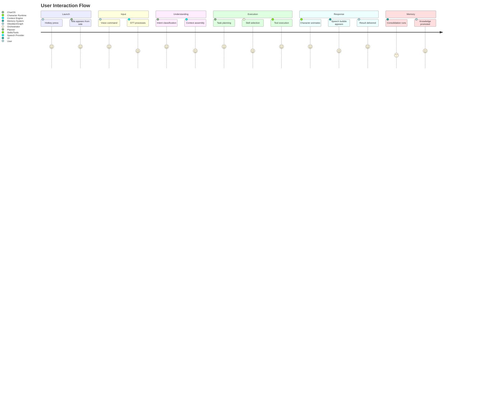
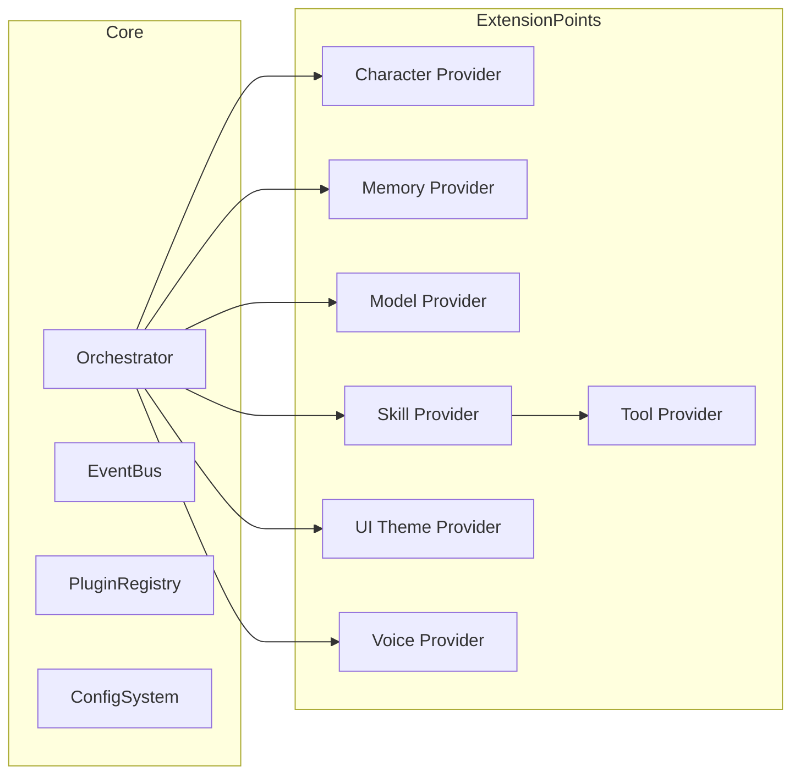

# 00_VISION.md

> **Purpose:** Define the long-term vision for CharOS — what it is, why it exists, and where it is going.
>
> This document is the north star for all architectural decisions. Every subsystem should trace back to the vision stated here.

---

## 1. Executive Summary

**CharOS** is an open-source, local-first desktop companion platform that enables expressive AI characters to live alongside the user, understand context, automate work, and build long-term knowledge while respecting user privacy and control.

The default companion is **Nila**, but CharOS itself is **character-agnostic** — a platform, not a product tied to one persona.

---

## 2. The Problem

Modern AI assistants fall into two categories, both of which miss the mark for daily desktop use:

| Category | Examples | Limitation |
|----------|----------|------------|
| **Web chatbots** | ChatGPT, Claude, Gemini web | Require browser tabs, no desktop context, stateless, no automation |
| **Coding assistants** | GitHub Copilot, Cursor | Tied to IDEs, code-focused, no general desktop presence |

**The gap:** No open platform exists for a *persistent, character-driven desktop companion* that:
- Lives on the desktop as a visual presence (not a chat window)
- Understands screen content, voice, and user workflows
- Automates repetitive tasks across any application
- Remembers what matters across sessions
- Runs locally by default for privacy
- Is extensible by the community

---

## 3. The Vision

> **CharOS aims to make AI feel like a living desktop companion — not another chat window.**

### 3.1 Core Experience

```
┌─────────────────────────────────────────────────────────────────┐
│                        USER DESKTOP                             │
│                                                                 │
│   ┌──────────────┐                                              │
│   │   Code IDE   │                                              │
│   └──────────────┘                                              │
│                                                                 │
│   ┌──────────────┐          ┌──────────────────────┐           │
│   │   Browser    │          │       Nila           │           │
│   └──────────────┘          │  (side-docked VRM)   │           │
│                             │  🎤 Listening        │           │
│   ┌──────────────┐          │  💭 Thinking         │           │
│   │  Terminal    │          │  💬 "Found the bug!" │           │
│   └──────────────┘          └──────────────────────┘           │
│                                                                 │
│   ┌──────────────┐                                              │
│   │   Notes      │                                              │
│   └──────────────┘                                              │
└─────────────────────────────────────────────────────────────────┘
```

### 3.2 User Journey



---

## 4. Why CharOS Exists

### 4.1 For Users

- **Presence over chat:** A companion that feels alive on the desktop
- **Privacy by default:** Local-first execution; cloud only when explicitly chosen
- **Continuity:** Remembers preferences, workflows, and decisions across sessions
- **Automation:** Replaces repetitive clicks, searches, and boilerplate
- **Customization:** Swap characters, voices, themes, models without code changes

### 4.2 For Developers

- **Modular architecture:** Every subsystem replaceable via interfaces
- **Open ecosystem:** Build characters, skills, plugins, memory providers
- **Documentation-first:** Architecture understandable without reverse-engineering
- **AI-friendly:** Designed for both human and AI coding agents to extend

### 4.3 For the Ecosystem

- **Standards over silos:** Shared interfaces for models, memory, tools
- **Character portability:** A character pack works across any CharOS instance
- **Vendor neutrality:** No lock-in to any model provider or cloud service

---

## 5. High-Level Architecture

```
┌──────────────────────────────────────────────────────────────────────────────┐
│                              CHAROS PLATFORM                                 │
├──────────────────────────────────────────────────────────────────────────────┤
│                                                                              │
│  ┌─────────────┐   ┌─────────────┐   ┌─────────────┐   ┌─────────────┐     │
│  │   INPUT     │   │ UNDERSTAND  │   │ ORCHESTRATE │   │  EXECUTE    │     │
│  │   LAYER     │──▶│   LAYER     │──▶│   LAYER     │──▶│   LAYER     │     │
│  └─────────────┘   └─────────────┘   └─────────────┘   └─────────────┘     │
│       │                  │                  │                  │             │
│       ▼                  ▼                  ▼                  ▼             │
│  ┌─────────────┐   ┌─────────────┐   ┌─────────────┐   ┌─────────────┐     │
│  │  Mic/Keys   │   │   STT +     │   │   Planner   │   │  Skills     │     │
│  │  Screen     │   │   Intent +  │   │   + Router  │   │  + Tools    │     │
│  │  Capture    │   │   Vision    │   │             │   │             │     │
│  └─────────────┘   └─────────────┘   └─────────────┘   └─────────────┘     │
│                                                                              │
│  ┌─────────────────────────────────────────────────────────────────────┐    │
│  │                      MEMORY LAYER (Cross-cutting)                   │    │
│  │  Working ◀── Episodic ◀── Semantic ◀── Consolidated (Obsidian)     │    │
│  └─────────────────────────────────────────────────────────────────────┘    │
│                                                                              │
│  ┌─────────────────────────────────────────────────────────────────────┐    │
│  │                    PRESENTATION LAYER (Character)                   │    │
│  │  VRM Avatar ◀── Animations ◀── Expressions ◀── Speech Bubbles      │    │
│  └─────────────────────────────────────────────────────────────────────┘    │
│                                                                              │
│  ┌─────────────────────────────────────────────────────────────────────┐    │
│  │                      EXTENSION LAYER                                │    │
│  │  Plugins ◀── Character Packs ◀── Themes ◀── Voice Packs            │    │
│  └─────────────────────────────────────────────────────────────────────┘    │
│                                                                              │
└──────────────────────────────────────────────────────────────────────────────┘
```

### 5.1 Layer Responsibilities

| Layer | Responsibility | Key Components |
|-------|---------------|----------------|
| **Input** | Capture user intent | Microphone, keyboard, hotkeys, screen capture |
| **Understand** | Convert raw input to structured intent | STT, vision, intent classification, context assembly |
| **Orchestrate** | Decide what to do and how | Planner, model router, task graph, orchestrator |
| **Execute** | Perform actions on the system | Skills, tools, browser automation, MCP |
| **Memory** | Store, retrieve, consolidate knowledge | Working, episodic, semantic, consolidated |
| **Presentation** | Render character and communicate state | VRM runtime, animations, speech bubbles, overlay |
| **Extension** | Enable customization without core changes | Plugin API, character packs, themes, voices |

---

## 6. Design Philosophy

> **"The character is the product. The model is an implementation detail."**

### 6.1 Character-First UX

- Users interact with **Nila** (or their chosen character), not "Gemma 4" or "Qwen3 Coder"
- The character expresses state through animation, not loading spinners
- Personality, voice, and appearance are configurable without touching AI logic

### 6.2 Local-First, Cloud-Optional

- All core capabilities run locally via Ollama or similar
- Cloud fallback (browser automation to user-owned services) only when:
  - Local model cannot handle the task
  - User explicitly opts in
  - User already has authenticated sessions

### 6.3 Modularity as a Feature

```
┌─────────────────────────────────────────┐
│           CHAROS CORE                   │
│  (Orchestrator, Planner, Event Bus,     │
│   Plugin Registry, Config System)       │
└──────────────┬──────────────────────────┘
               │ Interfaces
       ┌───────┼───────┐
       ▼       ▼       ▼
┌──────────┐ ┌──────────┐ ┌──────────┐
│ Character│ │  Memory  │ │  Models  │
│ Providers│ │Providers │ │Providers │
└──────────┘ └──────────┘ └──────────┘
       │       │       │
       ▼       ▼       ▼
   Nila,    Obsidian,  Gemma,
   Others   Cognee,    Qwen,
            Custom     Custom
```

### 6.4 Tool-Driven, Not Prompt-Driven

- Planner decomposes goals into **skills** → **tools** → **actions**
- Models provide reasoning; they do not directly control the OS
- Skills encapsulate domain knowledge (e.g., "refactor code" ≠ "run sed")

---

## 7. Target Capabilities (MVP → Full Vision)

### 7.1 MVP (Steps 0–4 from roadmap)

| Capability | Description |
|------------|-------------|
| **Side-docked overlay** | Transparent, always-accessible character window |
| **Voice input** | Push-to-talk + wake hotkey via Handy-Parakeet |
| **Character runtime** | Idle/Listening/Thinking/Speaking states with VRM |
| **Local reasoning** | Gemma 4 Heretic for general tasks via Ollama |
| **Basic memory** | Working + episodic memory with Obsidian sync |

### 7.2 Full Vision (Steps 5–10+)

| Capability | Description |
|------------|-------------|
| **Agentic coding** | Qwen3 Coder Heretic for multi-step repo work |
| **Vision** | Qwen2-VL for screenshots, UI reading, OCR |
| **Skills system** | Filesystem, terminal, git, browser, search, notes |
| **Consolidation** | Daily "dreaming" job: summarize, link, promote, forget |
| **Knowledge graph** | Cognee integration for relational memory |
| **Cloud fallback** | Playwright automation to user's ChatGPT/Gemini/GLM |
| **Plugin ecosystem** | Community skills, characters, themes, memory backends |
| **Character packs** | Portable bundles: VRM + personality + voice + animations |

---

## 8. Success Criteria

A successful CharOS release enables a user to:

1. **Launch** the companion with a global shortcut
2. **Speak naturally** and be understood (STT + intent)
3. **Receive useful help** — not generic responses
4. **Automate repetitive work** — files, code, browser, terminal
5. **Understand what the assistant is doing** — via animations and bubbles
6. **Trust the assistant** — local-first, privacy-aware, auditable
7. **Customize the experience** — character, voice, theme, models
8. **Replace models without breaking workflows** — interface-based routing

---

## 9. Non-Goals (Explicitly Out of Scope)

| Non-Goal | Rationale |
|----------|-----------|
| Web-based chatbot | Contradicts desktop companion vision |
| Single-model dependency | Violates replaceability principle |
| Proprietary cloud backend | Violates local-first, privacy principles |
| One character hardcoded | Violates character-agnostic platform goal |
| Prompt marketplace | Skills/plugins are the extension mechanism |
| Mobile app | Desktop-first; mobile is a separate product |

---

## 10. Extension Points (Future-Proofing)

The following extension points are designed into the architecture from day one:



| Extension Point | Interface | Example Implementations |
|----------------|-----------|------------------------|
| **Character** | `CharacterProvider` | Nila, custom VRM, 2D sprite, text-only |
| **Memory** | `MemoryProvider` | Obsidian, SQLite, Cognee, custom graph |
| **Models** | `ReasoningProvider`, `VisionProvider`, `SpeechProvider` | Ollama, llama.cpp, cloud APIs, local GGUF |
| **Skills** | `SkillProvider` | Filesystem, git, browser, custom automation |
| **Tools** | `ToolProvider` | Shell, MCP, OS APIs, browser automation |
| **Themes** | `ThemeProvider` | Light, dark, high-contrast, user CSS |
| **Voices** | `VoiceProvider` | Piper, Kokoro, system TTS, cloud TTS |

---

## 11. Glossary

| Term | Definition |
|------|------------|
| **CharOS** | The platform/framework |
| **Character** | A companion persona (e.g., Nila) — appearance, personality, voice |
| **Companion** | A running Character instance interacting with the user |
| **Planner** | Breaks goals into executable tasks |
| **Orchestrator** | Coordinates planners, models, memory, and tools |
| **Skill** | High-level capability (Summarize, Backup, Refactor) |
| **Tool** | Low-level executable operation (filesystem, browser, git) |
| **Plugin** | Extension that adds new skills or integrations |
| **Provider** | Implementation of a capability behind an interface |
| **Working Memory** | Active context for the current task |
| **Episodic Memory** | Important events and experiences |
| **Semantic Memory** | Long-term factual knowledge |
| **Consolidation** | Daily process that summarizes and links memories |
| **Dreaming** | User-facing name for consolidation |
| **Overlay** | Transparent desktop UI hosting the character |
| **Speech Bubble** | Floating dialogue UI |

---

## 12. Open Design Questions

> These are intentionally undecided. Document alternatives and trade-offs here. Final decisions belong to the project owner.

### 12.1 Desktop Framework

| Option | Pros | Cons |
|--------|------|------|
| **Tauri + React** | Small bundle, Rust backend, WebView2 on Windows | WebView limitations, Rust learning curve |
| **Electron + React** | Mature, huge ecosystem | Large bundle, higher memory |
| **Wails + Go/React** | Go backend, native feel | Smaller community |
| **Native (Qt, GTK, WinUI)** | Best performance, native look | High effort, platform-specific code |

**Recommendation:** Tauri — aligns with local-first, small binary, Rust safety.

### 12.2 VRM Rendering Engine

| Option | Pros | Cons |
|--------|------|------|
| **Three.js + @pixiv/three-vrm** | Mature, WebGL, runs in WebView | JavaScript overhead |
| **Bevy + bevy_vrm** | Rust-native, ECS, performant | Requires Tauri Rust side, less mature VRM support |
| **Custom WebGPU** | Modern, performant | High implementation effort |

**Recommendation:** Three.js in WebView — fastest path to working avatar.

### 12.3 IPC Strategy

| Option | Pros | Cons |
|--------|------|------|
| **Tauri Commands** | Built-in, type-safe, secure | Limited to Tauri |
| **gRPC/Protobuf** | Language-agnostic, performant | More setup |
| **NATS/Message Bus** | Decoupled, scalable | Overkill for local app |
| **Shared Memory + Events** | Fast, simple | Platform-specific |

**Recommendation:** Tauri Commands for UI↔Core; local event bus for Core↔Services.

### 12.4 Plugin Loading

| Option | Pros | Cons |
|--------|------|------|
| **WASM plugins** | Sandboxed, language-agnostic | Limited OS access, complex tooling |
| **Dynamic libraries (dlopen)** | Native performance, full OS access | Security risk, platform-specific |
| **Process-based (subprocess)** | Isolated, any language | IPC overhead, process management |
| **TypeScript/JS plugins** | Easy to write, hot reload | Runs in same process, less isolation |

**Recommendation:** Process-based with MCP-style JSON-RPC — balances isolation, language freedom, and ecosystem alignment.

---

## 13. Cross-References

| Document | Relationship |
|----------|--------------|
| `README.md` | Project overview and quick start |
| `roadmap.md` | Phased implementation plan |
| `PROJECT_BIBLE.md` | Constitutional principles |
| `AI_CONTEXT.md` | Instructions for AI coding agents |
| `ARCHITECTURE_PRINCIPLES.md` | Non-negotiable architectural rules |
| `CODING_PRINCIPLES.md` | Engineering standards |
| `NAMING.md` | Canonical terminology |
| `docs/01_ARCHITECTURE.md` | Detailed system architecture |
| `docs/02_DESIGN_PHILOSOPHY.md` | UX and design principles |
| `docs/03_TERMINOLOGY.md` | Expanded glossary |
| `docs/04_PROJECT_STRUCTURE.md` | Repository layout |
| `docs/05_TECH_STACK.md` | Technology selections |
| `docs/07_CHARACTER_GUIDELINES.md` | Character system specification |
| `docs/08_AI_GUIDELINES.md` | AI/model integration patterns |
| `docs/09_ROADMAP_DETAILS.md` | Detailed milestone breakdown |
| `ai/AGENTS.md` | Agent system design |
| `ai/PLANNER.md` | Planner architecture |
| `ai/MODEL_ROUTING.md` | Model selection and routing |
| `memory/MEMORY.md` | Memory system architecture |
| `character/CHARACTER_SPEC.md` | Character system specification |
| `plugins/PLUGIN_API.md` | Plugin system design |

---

## 14. TODOs for Implementation

- [ ] Initialize public Git repository with license
- [ ] Create `docs/` directory structure per roadmap
- [ ] Write `docs/01_ARCHITECTURE.md` with detailed component diagrams
- [ ] Write `docs/02_DESIGN_PHILOSOPHY.md` with UX principles
- [ ] Write `docs/03_TERMINOLOGY.md` with expanded glossary
- [ ] Define ADR template in `ADR/0000-template.md`
- [ ] Record ADR for desktop framework selection
- [ ] Record ADR for VRM rendering approach
- [ ] Record ADR for IPC strategy
- [ ] Record ADR for plugin architecture
- [ ] Create `CONTRIBUTING.md` with architecture reading requirements
- [ ] Create `SECURITY.md` with threat model
- [ ] Set up CI/CD pipeline for documentation validation

---

> **CharOS is the platform. Nila is just the beginning. 🌸**
>
> *This vision document should be revisited at each major milestone. Architecture evolves; vision endures.*