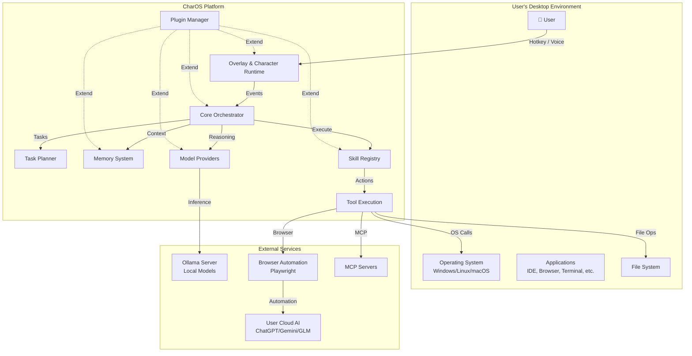
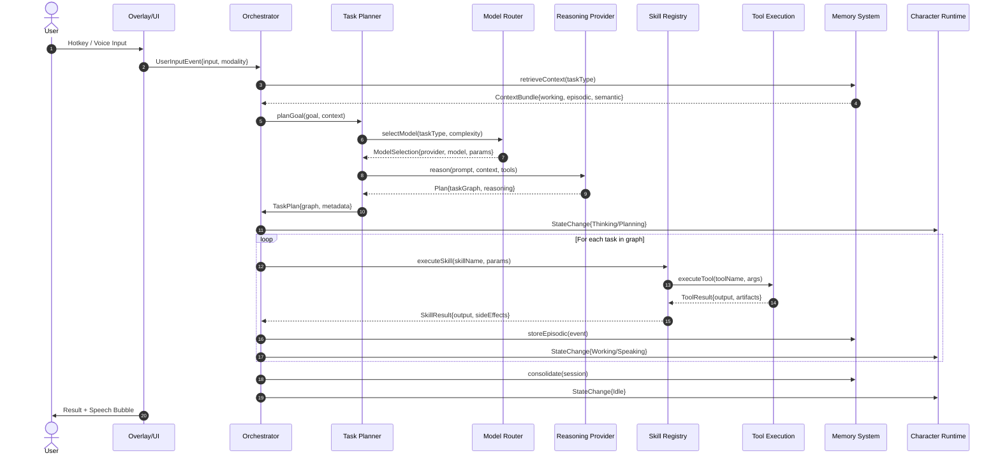
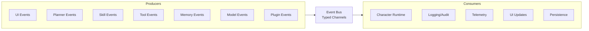
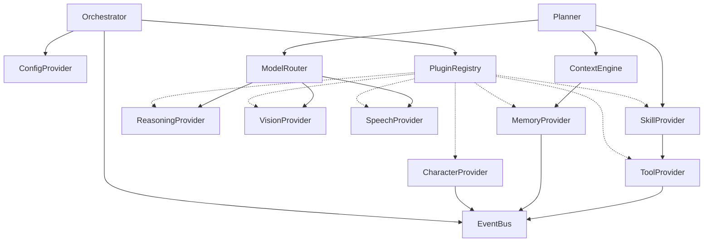
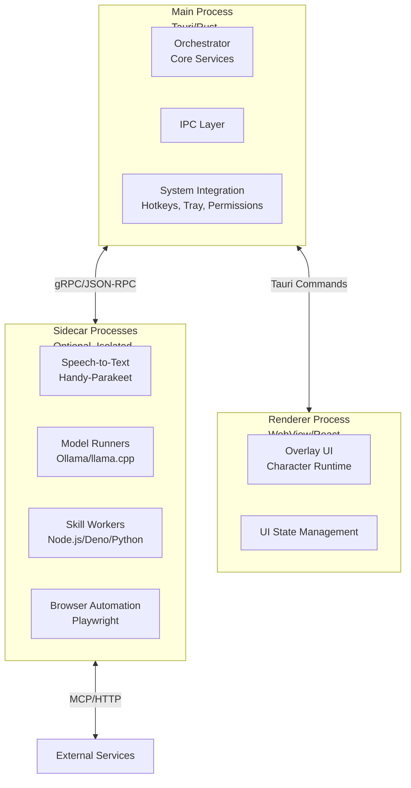
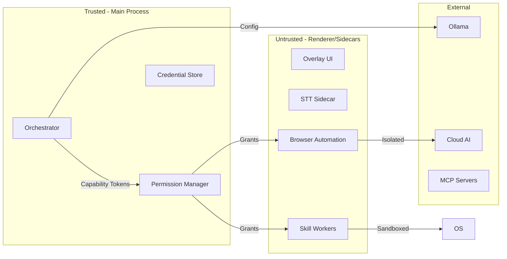
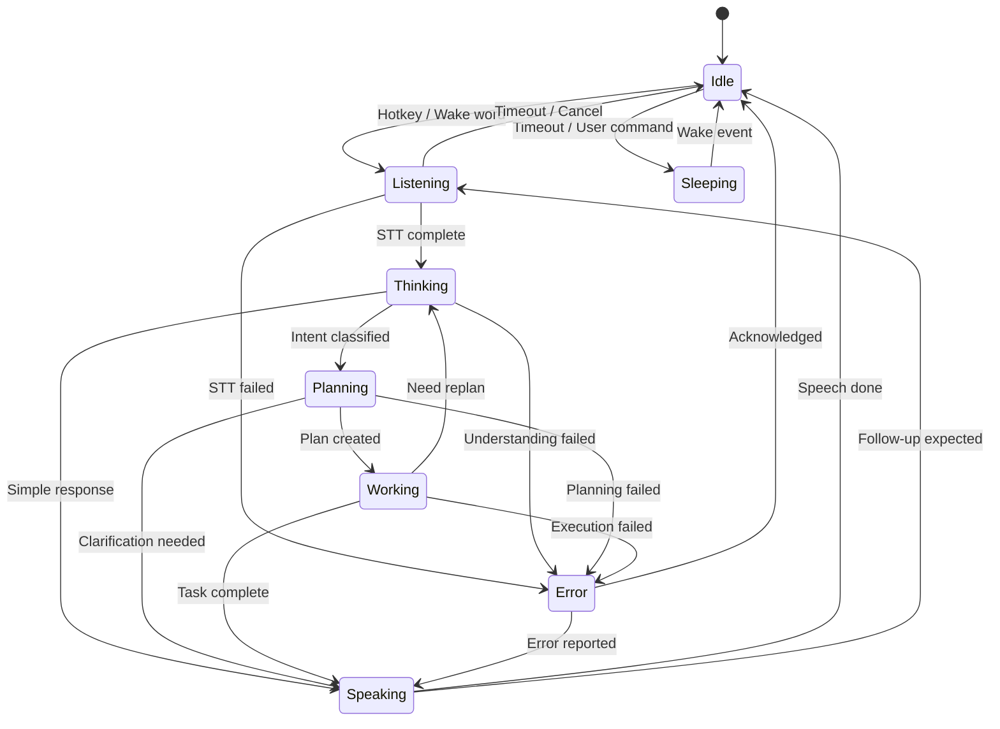
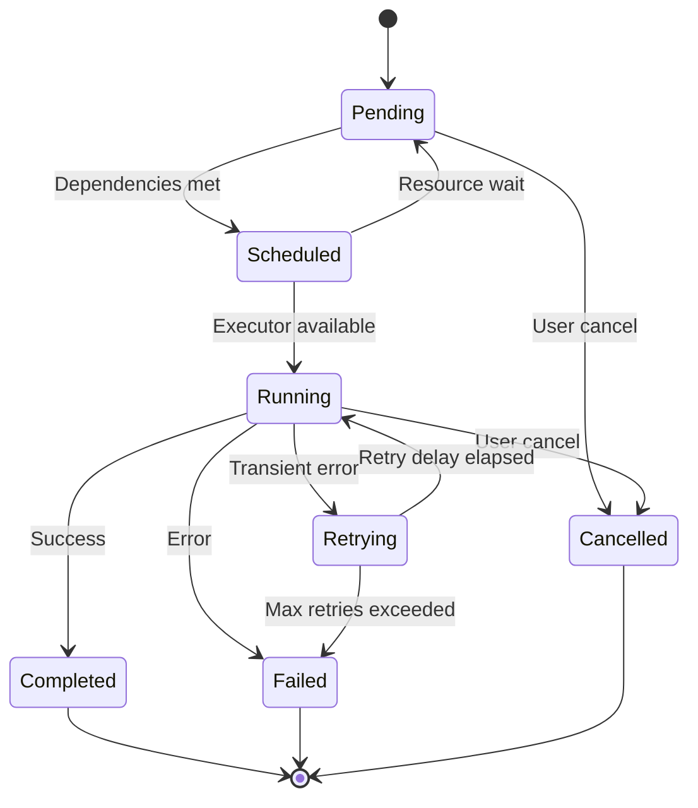
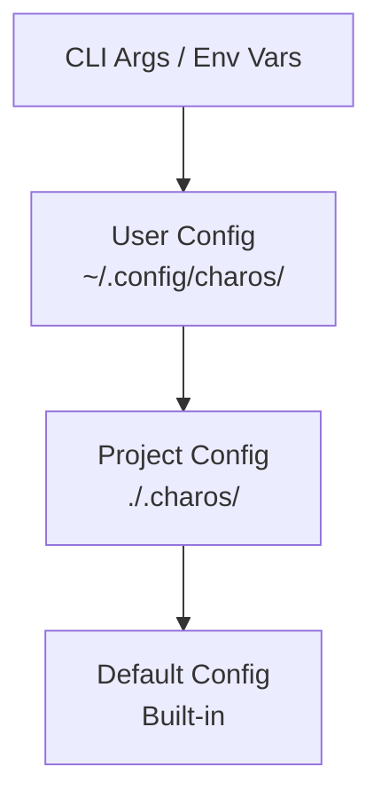
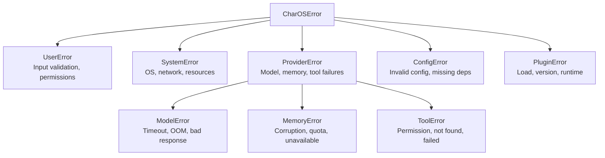

# 01_ARCHITECTURE.md

> **Purpose:** Define the complete system architecture for CharOS — components, interfaces, data flows, and deployment model.
>
> This document is the technical blueprint. Every implementation decision should trace back to here.

---

## 1. Architectural Overview

### 1.1 System Context



### 1.2 Core Principles (from ARCHITECTURE_PRINCIPLES.md)

| Principle | Architectural Implication |
|-----------|---------------------------|
| **Separation of Concerns** | 7 independent subsystems with single responsibilities |
| **Character ≠ Intelligence** | Character runtime is a presentation layer only |
| **Models are Replaceable** | All model access via `Provider` interfaces |
| **Tool-Driven** | Planner → Skills → Tools → OS (never Planner → Model → OS) |
| **Interface First** | Core depends on abstractions, not implementations |
| **Local First** | Default path uses local models; cloud is opt-in fallback |
| **Event-Driven** | Cross-cutting communication via event bus |
| **Layered Memory** | 4 distinct memory layers with different retention |
| **Context Assembly** | Built from multiple sources, never raw history dump |
| **Explicit State Machines** | Character, Planner, Tasks all use defined states |

---

## 2. Subsystem Architecture

### 2.1 Subsystem Map

```
┌─────────────────────────────────────────────────────────────────────────────┐
│                           CHAROS CORE (Rust/TypeScript)                     │
│  ┌──────────────┐ ┌──────────────┐ ┌──────────────┐ ┌──────────────┐       │
│  │ Orchestrator │ │  Event Bus   │ │ Config System│ │Plugin Registry│       │
│  └──────┬───────┘ └──────┬───────┘ └──────┬───────┘ └──────┬───────┘       │
└─────────┼────────────────┼────────────────┼────────────────┼────────────────┘
          │                │                │                │
    ┌─────┴─────┐    ┌─────┴─────┐    ┌─────┴─────┐    ┌─────┴─────┐
    ▼           ▼    ▼           ▼    ▼           ▼    ▼           ▼
┌────────┐ ┌──────────┐ ┌────────┐ ┌──────────┐ ┌────────┐ ┌──────────┐
│Character│ │ Planner  │ │ Memory │ │ Models   │ │ Skills │ │ Tools    │
│Runtime │ │          │ │        │ │          │ │        │ │          │
└────────┘ └──────────┘ └────────┘ └──────────┘ └────────┘ └──────────┘
    │           │          │          │          │          │
    ▼           ▼          ▼          ▼          ▼          ▼
┌────────┐ ┌──────────┐ ┌────────┐ ┌──────────┐ ┌────────┐ ┌──────────┐
│VRM/Anim│ │Task Graph│ │Working │ │Reasoning │ │File    │ │Shell     │
│Speech  │ │Router    │ │Episodic│ │Vision    │ │Terminal│ │Browser   │
│Bubbles │ │Scheduler │ │Semantic│ │Speech    │ │Git     │ │MCP       │
│Overlay │ │          │ │Consolid│ │Router    │ │Browser │ │          │
└────────┘ └──────────┘ └────────┘ └──────────┘ └────────┘ └──────────┘
```

### 2.2 Subsystem Responsibilities

| Subsystem | Responsibility | Key Interfaces | State |
|-----------|---------------|----------------|-------|
| **Core Orchestrator** | System lifecycle, dependency wiring, event routing | `Orchestrator`, `ServiceRegistry` | Singleton |
| **Event Bus** | Decoupled pub/sub for cross-subsystem communication | `EventEmitter`, `EventHandler` | Stateless |
| **Config System** | Hierarchical config (defaults → user → project → env) | `ConfigProvider`, `ConfigSchema` | Reactive |
| **Plugin Registry** | Discovery, loading, validation, lifecycle | `PluginProvider`, `PluginManifest` | Dynamic |
| **Character Runtime** | Avatar rendering, animation state machine, speech bubbles | `CharacterProvider`, `AnimationController` | State Machine |
| **Planner** | Goal decomposition, task graph creation, model routing | `Planner`, `TaskGraph`, `ModelRouter` | Stateless per task |
| **Memory System** | Multi-layer storage, retrieval, consolidation | `MemoryProvider`, `ContextEngine` | Persistent |
| **Model Providers** | Unified interface for reasoning/vision/speech | `ReasoningProvider`, `VisionProvider`, `SpeechProvider` | Pooled |
| **Skill Registry** | Capability discovery, parameter validation, execution | `SkillProvider`, `SkillManifest` | Dynamic |
| **Tool Execution** | Safe OS interaction, permissions, audit logging | `ToolProvider`, `PermissionManager` | Ephemeral |

---

## 3. Data Flow Architecture

### 3.1 Primary Request Flow



### 3.2 Event Flow (Cross-Cutting)



| Event Channel | Events | Consumers |
|--------------|--------|-----------|
| `character.state` | `CharacterStateChanged{from, to}`, `AnimationTriggered{name}` | Character Runtime, UI |
| `task.lifecycle` | `TaskStarted`, `TaskProgress`, `TaskCompleted`, `TaskFailed` | Planner, UI, Logging |
| `memory.updated` | `MemoryStored{layer, key}`, `ConsolidationCompleted` | Memory, Planner |
| `model.invocation` | `ModelRequested{provider, task}`, `ModelResponse{latency, tokens}` | Router, Metrics, Logging |
| `tool.execution` | `ToolInvoked{name, args}`, `ToolResult{output, duration}` | Skills, Permissions, Audit |
| `plugin.lifecycle` | `PluginLoaded`, `PluginUnloaded`, `PluginError` | Registry, UI |
| `system.health` | `ServiceHealthy`, `ServiceDegraded`, `ServiceDown` | Orchestrator, UI |

---

## 4. Interface Contracts

### 4.1 Core Interfaces (TypeScript-like pseudocode)

```typescript
// ============================
// ORCHESTRATOR
// ============================
interface Orchestrator {
  initialize(): Promise<void>;
  shutdown(): Promise<void>;
  handleUserInput(input: UserInput): Promise<TaskResult>;
  getService<T>(token: ServiceToken<T>): T;
  registerService<T>(token: ServiceToken<T>, impl: T): void;
}

// ============================
// EVENT BUS
// ============================
interface EventBus {
  emit<T extends BaseEvent>(channel: string, event: T): void;
  on<T extends BaseEvent>(channel: string, handler: EventHandler<T>): Subscription;
  once<T extends BaseEvent>(channel: string, handler: EventHandler<T>): Subscription;
}

interface BaseEvent {
  timestamp: number;
  correlationId: string;
  source: string;
}

// ============================
// CONFIG SYSTEM
// ============================
interface ConfigProvider {
  get<T>(key: string): T;
  set<T>(key: string, value: T): void;
  watch<T>(key: string, callback: (value: T) => void): Subscription;
  validate(schema: ConfigSchema): ValidationResult;
}

// ============================
// PLUGIN REGISTRY
// ============================
interface PluginRegistry {
  load(manifest: PluginManifest): Promise<PluginInstance>;
  unload(pluginId: string): Promise<void>;
  getPlugin(pluginId: string): PluginInstance | null;
  listPlugins(): PluginManifest[];
  getExtensions<T>(extensionPoint: string): T[];
}

// ============================
// CHARACTER PROVIDER
// ============================
interface CharacterProvider {
  readonly id: string;
  readonly metadata: CharacterMetadata;
  initialize(runtime: CharacterRuntime): Promise<void>;
  setState(state: CharacterState): Promise<void>;
  speak(text: string, emotion?: Emotion): Promise<void>;
  showBubble(content: BubbleContent): Promise<void>;
  triggerAnimation(name: string, params?: AnimationParams): Promise<void>;
  dispose(): Promise<void>;
}

type CharacterState =
  | 'idle'
  | 'listening'
  | 'thinking'
  | 'planning'
  | 'working'
  | 'speaking'
  | 'success'
  | 'error'
  | 'sleeping';

// ============================
// PLANNER
// ============================
interface Planner {
  planGoal(goal: Goal, context: ContextBundle): Promise<TaskPlan>;
  decomposeTask(task: Task, context: ContextBundle): Promise<TaskGraph>;
  estimateComplexity(task: Task): ComplexityLevel;
}

interface TaskPlan {
  graph: TaskGraph;
  estimatedDuration: Duration;
  requiredCapabilities: Capability[];
  fallbackPlan?: TaskPlan;
}

interface TaskGraph {
  nodes: TaskNode[];
  edges: TaskEdge[];
  entryPoints: string[];
}

interface TaskNode {
  id: string;
  skill: string;
  params: Record<string, unknown>;
  dependencies: string[];
  retryPolicy: RetryPolicy;
}

// ============================
// MODEL ROUTER
// ============================
interface ModelRouter {
  selectReasoning(task: Task, context: ContextBundle): Promise<ModelSelection>;
  selectVision(task: Task): Promise<ModelSelection>;
  selectSpeech(task: Task): Promise<ModelSelection>;
  getAvailableModels(): ModelCatalog;
}

interface ModelSelection {
  provider: string;
  model: string;
  parameters: ModelParameters;
  fallback?: ModelSelection;
}

// ============================
// PROVIDER INTERFACES
// ============================
interface ReasoningProvider {
  readonly id: string;
  readonly capabilities: ReasoningCapability[];
  complete(request: CompletionRequest): Promise<CompletionResponse>;
  stream(request: CompletionRequest): AsyncIterable<CompletionChunk>;
}

interface VisionProvider {
  readonly id: string;
  analyze(image: ImageInput, prompt: string): Promise<VisionResult>;
}

interface SpeechProvider {
  readonly id: string;
  transcribe(audio: AudioInput): Promise<TranscriptionResult>;
  synthesize(text: string, voice?: VoiceConfig): Promise<AudioOutput>;
}

// ============================
// MEMORY PROVIDER
// ============================
interface MemoryProvider {
  readonly id: string;
  readonly layer: MemoryLayer;
  store(entry: MemoryEntry): Promise<void>;
  retrieve(query: MemoryQuery): Promise<MemoryEntry[]>;
  delete(key: string): Promise<void>;
  consolidate(): Promise<ConsolidationReport>;
}

type MemoryLayer = 'working' | 'episodic' | 'semantic' | 'consolidated';

// ============================
// CONTEXT ENGINE
// ============================
interface ContextEngine {
  buildContext(task: Task, memory: MemorySystem): Promise<ContextBundle>;
  rankRelevance(items: ContextItem[], task: Task): ContextItem[];
  compressContext(context: ContextBundle, maxTokens: number): ContextBundle;
}

interface ContextBundle {
  workingMemory: ContextItem[];
  episodicMemory: ContextItem[];
  semanticMemory: ContextItem[];
  projectKnowledge: ContextItem[];
  retrievedNotes: ContextItem[];
  tokenBudget: TokenBudget;
}

// ============================
// SKILL PROVIDER
// ============================
interface SkillProvider {
  readonly manifest: SkillManifest;
  execute(params: SkillParams, context: SkillContext): Promise<SkillResult>;
  validateParams(params: SkillParams): ValidationResult;
  estimateCost(params: SkillParams): CostEstimate;
}

interface SkillManifest {
  id: string;
  name: string;
  description: string;
  category: SkillCategory;
  inputs: ParameterSchema[];
  outputs: ParameterSchema[];
  permissions: Permission[];
  tags: string[];
}

// ============================
// TOOL PROVIDER
// ============================
interface ToolProvider {
  readonly manifest: ToolManifest;
  execute(args: ToolArgs, context: ToolContext): Promise<ToolResult>;
  validateArgs(args: ToolArgs): ValidationResult;
}

interface ToolManifest {
  id: string;
  name: string;
  description: string;
  category: ToolCategory;
  schema: JSONSchema;
  permissions: Permission[];
  idempotent: boolean;
}
```

### 4.2 Interface Dependency Graph



---

## 5. Deployment Architecture

### 5.1 Process Model



### 5.2 Communication Patterns

| Path | Protocol | Use Case |
|------|----------|----------|
| Main ↔ Renderer | Tauri Commands (Invoke) | UI actions, config, synchronous requests |
| Main ↔ Renderer | Tauri Events (Emit/Listen) | State updates, notifications, streaming |
| Main ↔ Sidecars | gRPC / JSON-RPC over stdio | High-throughput model inference, skills |
| Sidecars ↔ External | HTTP / MCP / WebSocket | Ollama, browser automation, cloud APIs |
| Main ↔ OS | Native APIs | Hotkeys, file watchers, notifications, tray |

### 5.3 Security Boundaries



| Boundary | Mechanism |
|----------|-----------|
| Main ↔ Renderer | Tauri capability-based permissions (no Node.js in renderer) |
| Main ↔ Sidecars | Process isolation + JSON-RPC with schema validation |
| Skills ↔ OS | Permission manager: each tool declares required permissions |
| Browser ↔ Cloud | Isolated Playwright profile, no access to user's main browser |
| Credentials | OS keyring (Windows Credential Manager, libsecret, Keychain) |

---

## 6. State Management

### 6.1 Character State Machine



### 6.2 Task State Machine



### 6.3 System State (Persisted)

| State | Storage | Scope |
|-------|---------|-------|
| User config | `~/.config/charos/config.toml` | Global |
| Project config | `<project>/.charos/config.toml` | Per-project |
| Character state | In-memory (ephemeral) | Session |
| Memory layers | Provider-specific (SQLite, FS, Graph) | Persistent |
| Plugin registry | `~/.config/charos/plugins.json` | Global |
| Model catalog | `~/.config/charos/models.json` | Global |
| Session history | In-memory + episodic memory | Session + Persistent |

---

## 7. Configuration Architecture

### 7.1 Configuration Hierarchy (Highest → Lowest Priority)



### 7.2 Configuration Schema (Key Sections)

```toml
# ~/.config/charos/config.toml

[core]
log_level = "info"
data_dir = "~/.local/share/charos"
plugin_dir = "~/.config/charos/plugins"

[character]
default = "nila"
theme = "default"
voice = "piper-en-us-lessac"

[character.nila]
vrm_path = "assets/vrm/nila.vrm"
idle_animation = "idle_breathing"
speech_bubble_color = "#ff69b4"

[models]
default_reasoning = "gemma-4-heretic"
default_coding = "qwen3-coder-heretic-30b-a3b"
default_vision = "qwen2-vl"
default_speech = "handy-parakeet-v3"

[models.routing]
# Complexity thresholds for auto-routing
simple_threshold = 0.3
medium_threshold = 0.6
complex_threshold = 0.8

[memory]
working_ttl_hours = 24
episodic_max_entries = 10000
semantic_provider = "obsidian"
consolidation_schedule = "0 3 * * *"  # Daily 3 AM

[memory.obsidian]
vault_path = "~/Obsidian/CharOS"
auto_link = true

[skills]
enabled = ["filesystem", "terminal", "git", "browser", "search", "notes"]
timeout_seconds = 120

[tools]
shell = "pwsh"  # or "bash", "zsh"
allow_network = true
allow_write = true
confirm_destructive = true

[plugins]
auto_load = true
trusted_sources = ["https://plugins.charos.dev"]

[ui]
overlay_position = "right"
overlay_width = 320
transparency = 0.95
animation_fps = 60
reduced_motion = false

[privacy]
telemetry = false
crash_reports = false
local_only_mode = false
```

---

## 8. Extension Points Deep Dive

### 8.1 Character Provider Extension

```typescript
// plugins/character-mychar/manifest.json
{
  "id": "character-mychar",
  "type": "character",
  "name": "My Character",
  "version": "1.0.0",
  "entry": "dist/index.js",
  "provides": ["character"],
  "character": {
    "id": "mychar",
    "name": "MyChar",
    "vrm": "assets/mychar.vrm",
    "animations": {
      "idle": "animations/idle.glb",
      "thinking": "animations/thinking.glb",
      "speaking": "animations/speaking.glb"
    },
    "expressions": ["happy", "sad", "confused", "excited"],
    "voice": "piper-en-us-amy"
  }
}
```

### 8.2 Memory Provider Extension

```typescript
// plugins/memory-custom/manifest.json
{
  "id": "memory-custom",
  "type": "memory",
  "name": "Custom Memory Backend",
  "version": "1.0.0",
  "entry": "dist/index.js",
  "provides": ["memory"],
  "memory": {
    "layers": ["working", "episodic", "semantic"],
    "config_schema": {
      "type": "object",
      "properties": {
        "connection_string": { "type": "string" },
        "namespace": { "type": "string" }
      }
    }
  }
}
```

### 8.3 Skill Provider Extension

```typescript
// plugins/skill-docker/manifest.json
{
  "id": "skill-docker",
  "type": "skill",
  "name": "Docker Management",
  "version": "1.0.0",
  "entry": "dist/index.js",
  "provides": ["skill"],
  "skills": [
    {
      "id": "docker.build",
      "name": "Build Docker Image",
      "description": "Build a Docker image from a Dockerfile",
      "category": "devops",
      "inputs": [
        { "name": "path", "type": "string", "required": true },
        { "name": "tag", "type": "string", "required": true },
        { "name": "build_args", "type": "object", "required": false }
      ],
      "outputs": [
        { "name": "image_id", "type": "string" }
      ],
      "permissions": ["docker", "filesystem.read"]
    }
  ]
}
```

---

## 9. Error Handling & Resilience

### 9.1 Error Taxonomy



### 9.2 Resilience Patterns

| Pattern | Applied To |
|---------|------------|
| **Circuit Breaker** | Model providers, external APIs |
| **Retry with Backoff** | Tool execution, network calls |
| **Fallback Chain** | Model routing (local → cloud) |
| **Bulkhead** | Sidecar processes (isolated failures) |
| **Timeout Budgets** | Every async operation |
| **Graceful Degradation** | Character animations (reduced motion), memory (read-only mode) |

---

## 10. Observability

### 10.1 Structured Logging

```json
{
  "timestamp": "2026-06-30T10:30:45.123Z",
  "level": "INFO",
  "service": "planner",
  "trace_id": "abc-123",
  "span_id": "def-456",
  "event": "TaskPlanned",
  "data": {
    "goal": "refactor user service",
    "task_count": 5,
    "estimated_duration_ms": 45000,
    "model": "qwen3-coder-heretic-30b-a3b"
  }
}
```

### 10.2 Key Metrics

| Metric | Type | Description |
|--------|------|-------------|
| `charos.task.duration` | Histogram | End-to-end task latency |
| `charos.model.latency` | Histogram | Model inference time by provider |
| `charos.tool.success_rate` | Counter | Tool success/failure by tool |
| `charos.memory.retrieval_latency` | Histogram | Memory query performance |
| `charos.character.state_duration` | Histogram | Time in each character state |
| `charos.plugin.load_time` | Histogram | Plugin initialization time |

### 10.3 Health Checks

```typescript
interface HealthCheck {
  name: string;
  check(): Promise<HealthStatus>;
  interval: Duration;
  timeout: Duration;
}

type HealthStatus = 
  | { status: 'healthy'; details?: Record<string, unknown> }
  | { status: 'degraded'; reason: string; details?: Record<string, unknown> }
  | { status: 'unhealthy'; reason: string; details?: Record<string, unknown> };
```

---

## 11. Cross-References

| Document | Relationship |
|----------|--------------|
| `docs/00_VISION.md` | Vision and high-level architecture |
| `docs/02_DESIGN_PHILOSOPHY.md` | UX principles driving architecture |
| `docs/03_TERMINOLOGY.md` | Canonical terms used in interfaces |
| `docs/04_PROJECT_STRUCTURE.md` | Repository layout mapping to subsystems |
| `docs/05_TECH_STACK.md` | Technology choices for each layer |
| `docs/07_CHARACTER_GUIDELINES.md` | Character runtime specification |
| `docs/08_AI_GUIDELINES.md` | Model integration patterns |
| `ai/AGENTS.md` | Agent system architecture |
| `ai/PLANNER.md` | Planner internals |
| `ai/MODEL_ROUTING.md` | Routing algorithms |
| `ai/TOOL_ROUTING.md` | Tool selection |
| `memory/MEMORY.md` | Memory system architecture |
| `character/CHARACTER_SPEC.md` | Character system specification |
| `plugins/PLUGIN_API.md` | Plugin system design |
| `ADR/0001-project.md` | Project structure ADR |
| `ADR/0002-ui.md` | UI framework ADR |
| `ADR/0003-memory.md` | Memory backend ADR |
| `ADR/0004-model-routing.md` | Model routing ADR |
| `ADR/0005-mcp.md` | MCP integration ADR |

---

## 12. Open Design Questions

> Documented here per AI_CONTEXT.md — do not invent answers.

### 12.1 IPC: Tauri Commands vs. Custom Protocol

| Option | Pros | Cons |
|--------|------|------|
| Tauri Commands | Built-in, type-safe, secure | Limited to request-response |
| Custom gRPC | Streaming, bidirectional, language-agnostic | Additional dependency |
| NATS/Message Bus | Decoupled, replay, clustering | Overkill for local app |

**Status:** Leaning Tauri Commands + Events for now; gRPC for sidecars.

### 12.2 Sidecar Process Management

| Option | Pros | Cons |
|--------|------|------|
| Tauri Sidecar | Managed lifecycle, bundled | Limited to Tauri |
| Custom Process Manager | Full control, any binary | More code to maintain |
| Systemd/User Services | OS integration, restart policy | Platform-specific, install complexity |

**Status:** Tauri Sidecar for bundled (STT, models); User services for optional (Ollama).

### 12.3 Plugin Sandboxing Level

| Option | Pros | Cons |
|--------|------|------|
| Same Process (TS/JS) | Fast, hot reload, easy dev | No isolation, security risk |
| WASM | Sandboxed, portable | Limited syscalls, complex tooling |
| Subprocess (JSON-RPC) | Full isolation, any language | IPC overhead, process mgmt |
| Firecracker/MicroVM | Strongest isolation | Heavy, slow startup |

**Status:** Subprocess with JSON-RPC — balances isolation, language freedom, ecosystem alignment (MCP-style).

---

## 13. TODOs for Implementation

- [ ] Create `core/` directory with orchestrator skeleton
- [ ] Define `EventBus` implementation with typed channels
- [ ] Implement `ConfigProvider` with TOML + schema validation
- [ ] Design `PluginRegistry` with manifest validation
- [ ] Create `CharacterProvider` interface + VRM runtime stub
- [ ] Implement `Planner` with task graph data structures
- [ ] Build `ModelRouter` with capability-based selection
- [ ] Define `MemoryProvider` interface + Obsidian adapter stub
- [ ] Create `ContextEngine` with token budget management
- [ ] Design `SkillProvider` + `ToolProvider` interfaces
- [ ] Set up Tauri project with sidecar configuration
- [ ] Write integration tests for event bus + config
- [ ] Record ADR for desktop framework (Tauri)
- [ ] Record ADR for IPC strategy
- [ ] Record ADR for plugin architecture
- [ ] Record ADR for sidecar management

---

> **Architecture is not a diagram — it's the disciplined application of principles to decisions.**
>
> *This document evolves with ADRs. Never implement against a stale architecture.*