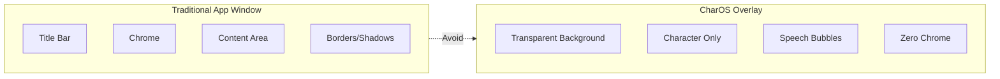
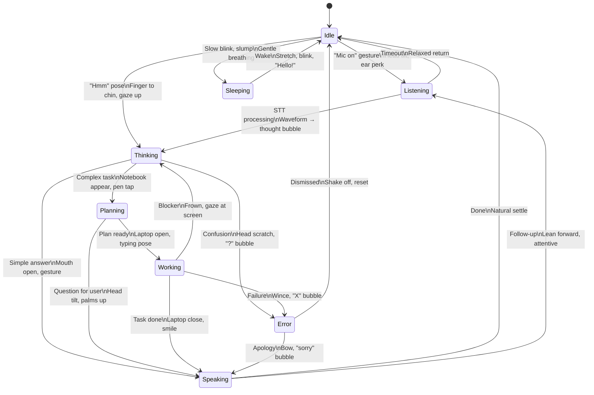
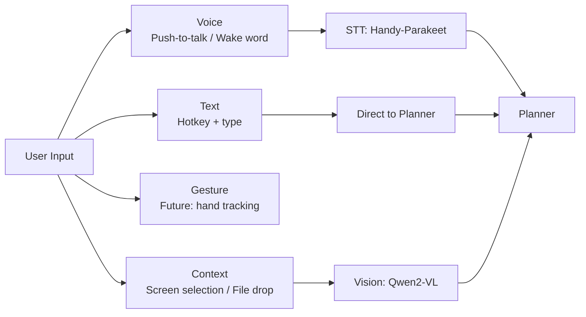
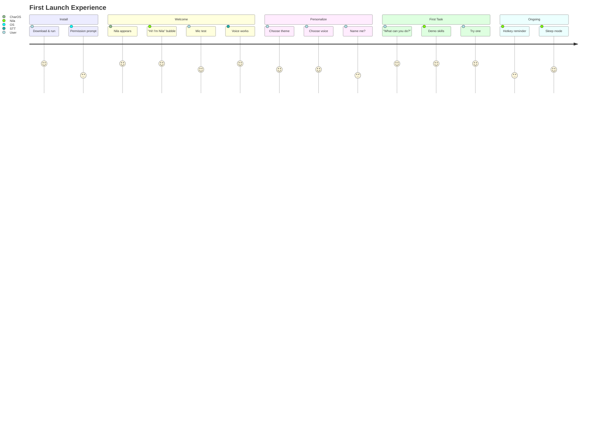

# 02_DESIGN_PHILOSOPHY.md

> **Purpose:** Define the user experience principles, visual design language, and interaction paradigms that make CharOS feel like a living companion — not a tool.
>
> This document guides every UI/UX decision. Implementation should serve these principles.

---

## 1. Core Philosophy

> **"The character is the product. The interface is the character."**

CharOS is not an AI chat interface with a mascot. It is a **character-driven desktop companion**. Every pixel, animation, and interaction should reinforce the illusion of a living presence sharing your workspace.

### 1.1 Design North Stars

| Principle | What It Means | What It Rejects |
|-----------|---------------|-----------------|
| **Presence over UI** | The companion feels like it *lives* on your desktop | Chat windows, panels, sidebars that look like apps |
| **Expression over information** | State communicated through animation, not labels | Loading spinners, status text, progress bars |
| **Calm over clutter** | Minimal, transparent, non-intrusive | Dense toolbars, persistent menus, notifications |
| **Personality over neutrality** | Opinionated, expressive, memorable | Generic, corporate, "helpful assistant" tone |
| **Trust over magic** | Visible reasoning, auditable actions, local-first | Black-box responses, hidden data collection |

---

## 2. Visual Design Language

### 2.1 The Overlay: Not a Window



**The overlay is the character's "body" on your desktop.**

| Property | Value | Rationale |
|----------|-------|-----------|
| **Background** | Fully transparent (alpha = 0) | Character appears to exist *on* your desktop |
| **Window chrome** | None | No title bar, borders, resize handles |
| **Click-through** | Optional (configurable) | Don't block interaction with apps behind |
| **Position** | Side-docked (left/right) | Peripheral vision, always accessible |
| **Width** | ~320px (configurable) | Wide enough for bubbles, narrow enough to not intrude |
| **Height** | Full screen height | Character can move vertically, enter/exit naturally |

### 2.2 Color System

```
┌─────────────────────────────────────────────────────────────────────┐
│                     CHAROS COLOR PALETTE                            │
├─────────────────────────────────────────────────────────────────────┤
│                                                                     │
│  PRIMARY (Nila)                                                     │
│  ┌─────────┐  ┌─────────┐  ┌─────────┐  ┌─────────┐  ┌─────────┐  │
│  │ #FF69B4 │  │ #FF85C1 │  │ #FFA3CE │  │ #FFC1DB │  │ #FFE0ED │  │
│  │  Hot    │  │  Bright │  │  Light  │  │  Softer │  │  Whisper│  │
│  │  Pink   │  │  Pink   │  │  Pink   │  │  Pink   │  │  Pink   │  │
│  └─────────┘  └─────────┘  └─────────┘  └─────────┘  └─────────┘  │
│                                                                     │
│  SEMANTIC                                                          │
│  ┌─────────┐  ┌─────────┐  ┌─────────┐  ┌─────────┐  ┌─────────┐  │
│  │ #10B981 │  │ #F59E0B │  │ #EF4444 │  │ #6366F1 │  │ #6B7280 │  │
│  │ Success │  │ Warning │  │ Error   │  │ Info    │  │ Neutral │  │
│  └─────────┘  └─────────┘  └─────────┘  └─────────┘  └─────────┘  │
│                                                                     │
│  NEUTRALS (Dark Mode First)                                         │
│  ┌─────────┐  ┌─────────┐  ┌─────────┐  ┌─────────┐  ┌─────────┐  │
│  │ #0F172A │  │ #1E293B │  │ #334155 │  │ #64748B │  │ #F1F5F9 │  │
│  │  BG     │  │  Surface│  │  Border │  │  Muted  │  │  Text   │  │
│  └─────────┘  └─────────┘  └─────────┘  └─────────┘  └─────────┘  │
│                                                                     │
│  THEME VARIANTS                                                     │
│  • Default (Nila Pink)     • Ocean (Teal)      • Sunset (Orange)   │
│  • Forest (Green)          • Violet (Purple)   • Monochrome (Gray) │
│  • High Contrast           • Reduced Motion    • Custom (User CSS) │
│                                                                     │
└─────────────────────────────────────────────────────────────────────┘
```

**Usage Rules:**
- Primary pink (`#FF69B4`) = Nila's identity color (speech bubbles, accent)
- Semantic colors only for *system* states (success/error), never character expression
- Character emotions expressed through **animation + bubble tone**, not color shifts
- Dark mode default; light mode as explicit theme variant

### 2.3 Typography

| Role | Font | Size | Weight | Usage |
|------|------|------|--------|-------|
| **Speech Bubble** | System UI (San Francisco / Segoe UI / Inter) | 14px | 400 | All dialogue |
| **Thinking Hint** | Same | 12px | 300 | "Thinking..." placeholder |
| **Skill Label** | Same | 11px | 500 | "Searching web...", "Reading file..." |
| **Settings/UI** | Same | 13px | 400 | Menus, preferences |
| **Code/Technical** | JetBrains Mono / Fira Code | 12px | 400 | Code snippets in bubbles |

**Principles:**
- System fonts first — no web font loading, instant render
- No custom font files in core (themes may override)
- Respect OS accessibility scaling
- Minimum 13px for readability

### 2.4 Spacing & Layout

```css
/* Design Tokens */
:root {
  --space-xs: 4px;   /* Icon gaps, tight groups */
  --space-sm: 8px;   /* Bubble padding, element gaps */
  --space-md: 16px;  /* Section spacing, bubble margins */
  --space-lg: 24px;  /* Major sections, overlay edges */
  --space-xl: 32px;  /* Full-screen sections */
  
  --radius-sm: 8px;  /* Bubble corners, small elements */
  --radius-md: 12px; /* Card corners */
  --radius-lg: 24px; /* Character silhouette bounds */
  --radius-full: 9999px; /* Pills, avatars */
  
  --shadow-soft: 0 2px 8px rgba(0,0,0,0.08);
  --shadow-medium: 0 8px 24px rgba(0,0,0,0.12);
  --shadow-strong: 0 16px 48px rgba(0,0,0,0.16);
  
  --transition-fast: 120ms ease-out;
  --transition-normal: 240ms ease-out;
  --transition-slow: 400ms ease-out;
}
```

---

## 3. Character Animation System

### 3.1 Animation as Communication

> **Animations are the character's body language. Every state change must be felt.**



### 3.2 Animation Specifications

| State | Entry Animation | Loop Animation | Exit Animation | Duration |
|-------|----------------|----------------|----------------|----------|
| **Idle** | Fade in + subtle settle | Breathing (4s cycle), micro-shifts | Fade out + slide to dock | ∞ |
| **Listening** | Mic appear (0.3s), head tilt | Waveform pulse (synced to audio), ear twitch | Mic fade, head return | 0.3s / ∞ / 0.3s |
| **Thinking** | "Hmm" pose (0.4s), thought bubble grow | Pupil drift, occasional blink | Thought bubble pop, pose release | 0.4s / ∞ / 0.3s |
| **Planning** | Notebook appear (0.5s), pen tap | Page flip (slow), gaze at pages | Notebook close, pen away | 0.5s / ∞ / 0.4s |
| **Working** | Laptop open (0.6s), typing start | Typing (procedural), screen glow | Laptop close (0.5s), satisfied nod | 0.6s / ∞ / 0.5s |
| **Speaking** | Mouth open sync (audio-driven) | Viseme loop, gesture emphasis | Mouth close, gesture settle | Audio sync / ∞ / 0.3s |
| **Success** | Sparkle burst (0.4s), bounce | Gentle glow pulse | Fade to idle | 0.4s / 2s / 0.5s |
| **Error** | Wince (0.2s), "X" bubble | Subtle shake | Shake off, bubble pop | 0.2s / ∞ / 0.4s |
| **Sleeping** | Slow blink (1s), slump | Deep breathing (6s cycle), occasional snore | Stretch (1s), blink awake | 1s / ∞ / 1s |

### 3.3 Procedural Animation Guidelines

- **Breathing:** Subtle chest/shoulder movement (0.5% scale, 4s cycle)
- **Micro-shifts:** Random weight shifts every 8-15s (2-3px translation)
- **Eye behavior:** 
  - Idle: Slow blink (3-5s), pupil drift toward mouse (subtle)
  - Listening: Fixed forward, waveform-reactive
  - Thinking: Gaze upward/distant, occasional blink
  - Speaking: Track "mouth" sync, occasional user glance
- **Physics:** All movements use spring physics (stiffness: 120, damping: 14)
- **Reduced motion:** All animations → instant transitions or single-frame states

### 3.4 VRM Integration

```typescript
interface VRMAnimationController {
  // State-driven
  setState(state: CharacterState): Promise<void>;
  
  // Expression blending
  setExpression(name: ExpressionName, weight: number): void;
  resetExpressions(): void;
  
  // Procedural
  setLookTarget(target: Vec3 | null): void;
  setBreathing(enabled: boolean, intensity?: number): void;
  
  // Lip sync
  setViseme(viseme: VisemeName, weight: number): void;
  
  // One-shots
  triggerGesture(name: GestureName): Promise<void>;
  playAnimation(clip: AnimationClip, layer: number): Promise<void>;
}
```

**Expression Map (Nila Default):**

| Expression | Blendshapes | Use Case |
|------------|-------------|----------|
| `neutral` | — | Baseline |
| `happy` | `eyeSmile`, `mouthSmile`, `cheekRaise` | Success, greeting |
| `thinking` | `browInnerUp`, `eyeWide`, `mouthOpen` | Thinking, planning |
| `confused` | `browDownLeft`, `browDownRight`, `mouthFrown` | Error, unclear |
| `excited` | `eyeWide`, `mouthOpen`, `browOuterUp` | Celebration, discovery |
| `sleepy` | `eyeClose`, `browInnerUp` | Sleeping, tired |
| `listening` | `eyeWide`, `browOuterUp` | Active listening |
| `speaking` | *Viseme-driven* | Speech synthesis |

---

## 4. Speech Bubble System

### 4.1 Bubble as Dialogue, Not Notification

```
┌────────────────────────────────────────────────────────────────┐
│  TRADITIONAL NOTIFICATION           CHAROS SPEECH BUBBLE       │
│  ┌─────────────────────┐           ┌─────────────────────┐     │
│  │ 🔔 Title            │           │        💭           │     │
│  │ Message text...     │           │  "Found the bug!"   │     │
│  │ [Action] [Dismiss]  │           │                     │     │
│  └─────────────────────┘           │  ── Nila            │     │
│                                    └─────────────────────┘     │
│  Impersonal, action-oriented      Personal, character-voiced   │
└────────────────────────────────────────────────────────────────┘
```

### 4.2 Bubble Anatomy

```mermaid
graph TD
    Bubble[Speech Bubble] --> Tail[Tail/Pointer\nToward character]
    Bubble --> Container[Container\nRounded, padded]
    Container --> Header[Header\nCharacter name + emotion icon]
    Container --> Content[Content\nMarkdown-supported]
    Content --> Text[Primary Text]
    Content --> Code[Code Blocks\nSyntax highlighted]
    Content --> List[Lists/Steps]
    Content --> Progress[Inline Progress\n"Reading file... ████░░ 60%"]
    Container --> Footer[Footer\nTimestamp / Actions]
    Footer --> Actions[Quick Actions\n"Show me" "Copy" "Dismiss"]
```

### 4.3 Bubble Variants

| Variant | Appearance | Use Case | Auto-Dismiss |
|---------|------------|----------|--------------|
| **Say** | Pink bg, white text, tail down | Normal dialogue | 8-15s (length-based) |
| **Think** | Gray bg, italic, tail up, "..." | Thinking/planning | Until next state |
| **Work** | Blue bg, monospace, tail up | Skill execution status | Until complete |
| **Success** | Green accent, ✓ icon | Task complete | 5s |
| **Error** | Red accent, ✕ icon, shake | Failure | Manual dismiss |
| **Ask** | Yellow accent, ? icon, buttons | Clarification needed | Manual dismiss |
| **Whisper** | Low opacity, small, no tail | Background hints | 3s |

### 4.4 Bubble Behavior

```typescript
interface BubbleBehavior {
  // Positioning
  anchor: 'character' | 'cursor' | 'screen-edge';
  offset: { x: number; y: number };
  avoidOverlap: boolean;
  
  // Lifecycle
  enterAnimation: 'slide' | 'fade' | 'pop' | 'typewriter';
  exitAnimation: 'fade' | 'slide' | 'pop';
  autoDismiss: boolean;
  dismissDelay: number; // ms, 0 = never
  
  // Interaction
  clickThrough: boolean;
  focusable: boolean;
  actions: BubbleAction[];
  
  // Content
  markdown: boolean;
  codeTheme: 'highlight': boolean;
  maxWidth: number;
  maxLines: number; // truncate with "Show more"
}
```

---

## 5. Interaction Paradigms

### 5.1 Input Modalities



| Modality | Activation | Feedback | Best For |
|----------|------------|----------|----------|
| **Voice (PTT)** | Hold `Alt+Space` | Listening animation + waveform | Natural commands, dictation |
| **Voice (Wake)** | "Hey Nila" (configurable) | Ear perk, glow | Hands-free, ambient |
| **Text** | Tap `Alt+Space` | Bubble appears, cursor ready | Precise queries, code, search |
| **Context** | Drag file / Select text + hotkey | "Understanding..." bubble | "Explain this", "Refactor that" |

### 5.2 The "No UI" Ideal

> **The best interface is the character itself.**

| Traditional UI | CharOS Equivalent |
|----------------|-------------------|
| Settings menu | "Nila, change my theme to dark" |
| Model selector | "Nila, use the coding model for this" |
| Memory viewer | "Nila, what do you remember about Project X?" |
| Skill marketplace | "Nila, can you learn to deploy to Vercel?" |
| Logs/debug | "Nila, why did that fail?" |
| Permissions dialog | "Nila, you can access my git repos now" |

**Implementation:** Natural language → Planner → Config/Skill/Memory actions

### 5.3 Feedback & Trust

```mermaid
graph TD
    Action[User Action] --> Immediate[Immediate Feedback\n<100ms]
    Immediate --> Progressive[Progressive Feedback\n100ms-5s]
    Progressive --> Completion[Completion Feedback\nResult + State]
    
    Immediate -->|Animation| Char[Character State Change]
    Immediate -->|Bubble| Bubble[Speech Bubble: "On it!"]
    
    Progressive -->|Steps| SkillBubbles[Skill Bubbles\n"Reading file...", "Searching..."]
    Progressive -->|Animation| WorkAnim[Working Animation\nTyping, laptop glow]
    
    Completion -->|Success| SuccessBubble[Success Bubble + Celebration]
    Completion -->|Error| ErrorBubble[Error Bubble + Explanation]
    Completion -->|Partial| PartialBubble[Partial Result + Options]
```

**Trust Signals:**
- **Visibility:** User sees *what* Nila is doing (skill bubbles)
- **Explainability:** "I used the search skill because..." (on request)
- **Control:** "Stop" always works; "Undo" for destructive actions
- **Privacy:** Local-first badge; cloud usage explicitly confirmed

---

## 6. Onboarding & First Experience

### 6.1 First Launch Flow



### 6.2 Progressive Disclosure

| Phase | Revealed | Hidden |
|-------|----------|--------|
| **Minute 1** | Hotkey, voice, basic chat | Models, memory, skills, plugins |
| **Day 1** | "What can you do?" → skill demo | Config files, advanced routing |
| **Week 1** | Memory ("Remember this"), themes | Consolidation, knowledge graph |
| **Month 1** | Character packs, custom skills | Plugin development, MCP |

---

## 7. Accessibility

### 7.1 Inclusive by Default

| Requirement | Implementation |
|-------------|----------------|
| **Screen readers** | All bubbles announced via ARIA live regions; character state as status |
| **Keyboard nav** | `Tab` through bubbles/actions; `Esc` dismisses; hotkeys configurable |
| **Reduced motion** | `prefers-reduced-motion` → instant transitions, static poses |
| **High contrast** | Theme variant: WCAG AAA contrast ratios |
| **Font scaling** | Respects OS 100%-500% scaling; bubbles reflow |
| **Voice-only** | Full operation without visual overlay (audio cues + TTS) |
| **Color blindness** | Never color-only encoding; icons + patterns + labels |

### 7.2 Character-Specific Accessibility

- **Viseme accuracy** critical for lip-reading users
- **Expression intensity** configurable (subtle → exaggerated)
- **Animation speed** configurable (0.5x → 2x)
- **Bubble persistence** configurable (3s → ∞)
- **Sound cues** for state changes (optional, customizable)

---

## 8. Theming & Customization

### 8.1 Theme Structure

```json
{
  "id": "ocean",
  "name": "Ocean",
  "description": "Cool teal tones for focused work",
  "author": "CharOS Team",
  "version": "1.0.0",
  "colors": {
    "primary": "#06B6D4",
    "primaryHover": "#0891B2",
    "primaryLight": "#67E8F9",
    "bubbleBackground": "rgba(22, 78, 99, 0.95)",
    "bubbleText": "#F0FDFA",
    "success": "#10B981",
    "warning": "#F59E0B",
    "error": "#EF4444"
  },
  "character": {
    "vrmTint": "#06B6D4",
    "eyeColor": "#06B6D4",
    "accentGlow": "rgba(6, 182, 212, 0.4)"
  },
  "animations": {
    "idleBreathing": "subtle",
    "transitionSpeed": "normal"
  },
  "fonts": {
    "ui": "system",
    "mono": "JetBrains Mono"
  }
}
```

### 8.2 Character Packs (Portable Personas)

```json
{
  "id": "nila-v2",
  "name": "Nila v2",
  "version": "2.0.0",
  "character": {
    "vrm": "nila.vrm",
    "thumbnail": "thumbnail.png",
    "personality": {
      "traits": ["curious", "playful", "helpful"],
      "speakingStyle": "casual, uses emoji, occasional puns",
      "greetings": ["Hey! 👋", "Hello there!", "What's up?"],
      "farewells": ["Bye! 🌸", "Catch you later!", "Sleep well~"]
    },
    "animations": {
      "idle": "idle_breathing.vrm",
      "thinking": "thinking_chin.vrm",
      "working": "working_laptop.vrm",
      "speaking": "speaking_gesture.vrm",
      "success": "success_bounce.vrm",
      "error": "error_wince.vrm",
      "sleeping": "sleeping_slump.vrm"
    },
    "expressions": ["neutral", "happy", "thinking", "confused", "excited", "sleepy", "listening"],
    "voice": "piper-en-us-lessac"
  },
  "theme": "default",
  "skills": ["core"],
  "compatibility": ">=1.0.0"
}
```

---

## 9. Anti-Patterns (What to Avoid)

| Anti-Pattern | Why It Breaks the Vision | Correct Approach |
|--------------|--------------------------|------------------|
| **Settings modal** | Breaks character immersion | Natural language config |
| **Model selector dropdown** | Exposes implementation | "Use the coding model" |
| **Loading spinner** | Mechanical, not alive | Thinking animation + "Hmm..." bubble |
| **Toast notifications** | Impersonal, dismissible | Speech bubbles from character |
| **Progress bars** | Utilitarian | "Reading file... ████░░" in bubble |
| **Error dialogs** | Scary, technical | Character winces, explains simply |
| **Onboarding wizard** | Feels like software setup | Conversational welcome |
| **Log viewer** | Developer tool | "Nila, why did that fail?" |
| **Plugin marketplace UI** | App store metaphor | "Nila, can you learn X?" |

---

## 10. Cross-References

| Document | Relationship |
|----------|--------------|
| `docs/00_VISION.md` | Vision driving design |
| `docs/01_ARCHITECTURE.md` | Architecture enabling design |
| `docs/03_TERMINOLOGY.md` | Canonical terms |
| `docs/06_UI_GUIDELINES.md` | Detailed UI component specs |
| `docs/07_CHARACTER_GUIDELINES.md` | Character system deep dive |
| `character/CHARACTER_SPEC.md` | Character specification |
| `character/ANIMATIONS.md` | Animation technical specs |
| `character/VOICE.md` | Voice/speech integration |
| `character/THEMES.md` | Theme system |
| `character/CHARACTER_PACKS.md` | Character pack format |
| `ui/OVERLAY.md` | Overlay implementation |
| `ui/SPEECH_BUBBLES.md` | Bubble implementation |
| `ui/ANIMATIONS.md` | Animation engine |
| `ui/SHORTCUTS.md` | Hotkey system |
| `ADR/0002-ui.md` | UI framework decision |

---

## 11. Open Design Questions

### 11.1 Character Entrance/Exit Choreography

| Option | Pros | Cons |
|--------|------|------|
| **Slide from edge** | Clear spatial metaphor, performant | Can feel "UI-like" |
| **Fade + scale** | Magical, dreamy | Less grounded |
| **Particle dissolve** | Expressive, unique | Performance, complexity |
| **Walk-in (VRM animation)** | Most alive | Requires walk cycle, pathfinding |

**Status:** Slide from edge for MVP; walk-in as stretch goal.

### 11.2 Multi-Monitor Behavior

| Option | Pros | Cons |
|--------|------|------|
| **Primary only** | Simple, predictable | Inconvenient on multi-monitor |
| **Follow cursor** | Always accessible | Can be distracting |
| **Per-monitor instance** | Native feel | Resource heavy, sync complexity |
| **User-assigned monitor** | Controlled | Manual config |

**Status:** Primary monitor default; user-assigned as config option.

### 11.3 Bubble Stacking vs. Replacement

| Option | Pros | Cons |
|--------|------|------|
| **Stack (newest top)** | History visible | Visual clutter |
| **Replace (single bubble)** | Clean, focused | Lose context |
| **Threaded (conversation view)** | Natural dialogue | More complex layout |
| **Hybrid (stack, auto-collapse old)** | Balance | Implementation complexity |

**Status:** Hybrid — stack with auto-collapse after 3 bubbles.

---

## 12. TODOs for Implementation

- [ ] Create design token system (CSS-in-JS or CSS custom properties)
- [ ] Build overlay window (transparent, click-through, side-docked)
- [ ] Implement VRM loader + Three.js renderer
- [ ] Build animation state machine (9 states + transitions)
- [ ] Create speech bubble component (variants, markdown, actions)
- [ ] Implement lip-sync (viseme mapping from TTS)
- [ ] Build theme system (CSS variables + character tint)
- [ ] Create character pack loader (VRM + manifest + animations)
- [ ] Implement hotkey system (global, configurable)
- [ ] Add accessibility: ARIA live regions, keyboard nav, reduced motion
- [ ] Build onboarding flow (conversational, progressive)
- [ ] Record ADR for UI framework (React + Three.js)
- [ ] Record ADR for VRM rendering approach
- [ ] Record ADR for animation engine

---

> **Design is not how it looks. Design is how it feels.**
>
> *If the user notices the interface, we've failed. They should only notice Nila.*