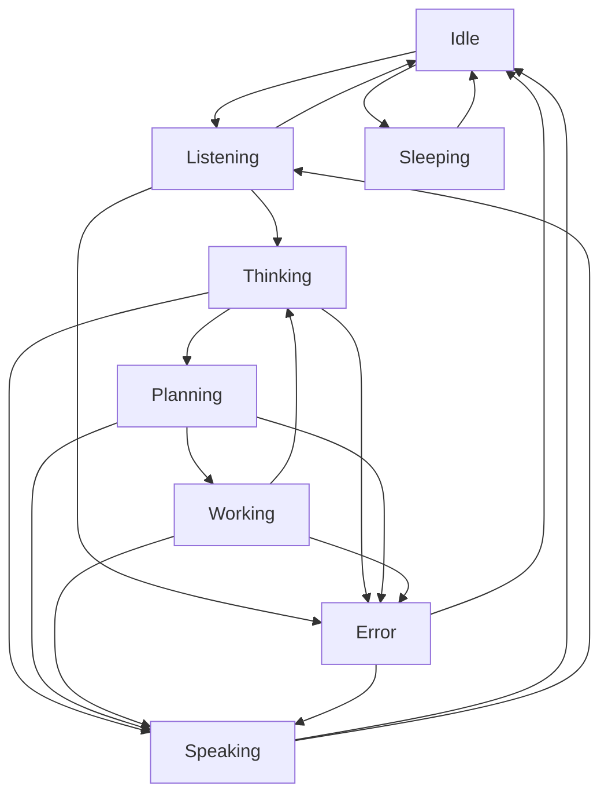

# 06_UI_GUIDELINES.md

> **Purpose:** Define the user interface architecture, component patterns, and interaction design for CharOS.
> This document guides every UI/UX decision, ensuring the character feels like a living companion on the user's desktop.

---

## 1. UI Architecture Philosophy

### 1.1 Overlay-First Design

> **The character is not in a window — the overlay is the character's body on your desktop.**

**Fundamental Principle:** Every UI decision serves the goal of making the character feel present without disrupting the user's workflow.

### 1.2 Core UI Properties

| Property | Value | Why It Matters |
|----------|-------|----------------|
| **Transparency** | 95-99% opacity | Character appears to inhabit desktop |
| **Z-index** | Above all apps, below dialogs | Always accessible, never blocking |
| **Size** | Configurable width (~320px), full height | Fits sidebar, non-intrusive |
| **Position** | Side-docked (left/right configurable) | Peripheral attention, minimal intrusion |
| **Interaction** | Click-through by default | Desktop remains functional |
| **Persistence** | Auto-hide when not active | Reduces visual clutter |

---

## 2. Component Architecture

### 2.1 Component Layering

```
┌─────────────────────────────────────────────────────────┐
│                    CHAROS OVERLAY UI                    │
├─────────────────────────────────────────────────────────┤
│  ┌─────────────────┐ ┌─────────────────────┐ ┌─────────────────┐ │
│  │   CORE UI      │ │   CHARACTER       │ │   DYNAMIC      │ │
│  │   SYSTEM       │ │   COMPONENTS      │ │   CONTENT      │ │
│  │                 │ │                   │ │                 │
│  │ ┌─────────────┐ │ │ ┌─────────────┐ ┌─────────────┐ │ │
│  │ │  LAYOUT    │ │ │ │   UI       │ │ │  POPUP       │ │ │
│  │ │  CONTROLLER│ │ │   ENGINE   │ │ │  OVERLAY     │ │ │
│  │ │             │ │ │             │ │ │             │ │
│  │ └──────┬───────┘ │ │ └──────┬───────┘ │ └──────┬───────┘ │
│  │        ▼          │          ▼            ▼            │
│  ┌──────────────┐ ┌──────────────┐ ┌──────────────┐ ┌─────────────┐ │
│  │ SPEECH       │ │ CHARACTER   │ │   SYSTEM    │ │  SETTINGS   │ │
│  │ BUBBLE       │ │  ANIMATIONS │ │  COMPONENTS │ │  PANEL      │ │
│  │             │ │             │ │             │ │             │
│  │ ┌──────────┐ │ │ ┌──────────┐ │ ┌──────────┐ │ ┌──────────┐ │ │
│  │ │  BUBBLE   │ │ │ │  CHARACTER│ │ │  TOOLTIP  │ │ │ │  HELP     │ │
│  │ │  UI       │ │ │ │  STATE    │ │ │  PROMPT    │ │ │ │  SCREEN   │ │
│  │ │  LAYER    │ │ │ │  MACHINE  │ │ │  OVERLAY   │ │ │ │  OVERLAY  │ │
│  │ │           │ │ │             │ │ │             │ │ │             │
│  └─────────────┘ │ └─────────────┘ │ └─────────────┘ │ └─────────────┘ │
└─────────────────────────────────────────────────────────┘
```

### 2.2 Component Responsibility Matrix

| Layer | Component | Responsibility | Examples |
|-------|-----------|----------------|----------|
| **Layout** | `OverlayContainer` | Window management, z-index, positioning | Side dock, auto-hide |
| | `CharacterDock` | Character docking, resize handles | Left/right positioning |
| | `FocusManager` | Tab order, focus restoration | Keyboard navigation |
| **Core UI** | `CharacterRenderer` | VRM display, animations | Avatar rendering |
| | `SpeechBubble` | Dialogue display, emotions | "Hello!", "Thinking..." |
| | `StateIndicator` | Character state visualization | Breathing, gestures |
| | `InteractionLayer` | Event capture, delegation | Mouse, touch, scroll |
| **Character Components** | `AnimationController` | Play animation states | Idle, listening, coding |
| | `ExpressionManager` | Facial expression system | Smile, frown, think |
| | `VoiceIndicator` | Speech visualization | Waveform, audio level |
| **Dynamic Content** | `SkillIndicator` | Task progress display | "Reading file..." |
| | `ModelSelector` | Model status UI | "Thinking with Gemma 4..." |
| | `MemoryIndicator` | Memory usage indicator | "Memory: 2.3GB / 10GB" |

---

## 3. Main Layout System

### 3.1 Overlay Structure

**Technical Spec:**

```css
/* Overlay Container */
.charos-overlay {
  position: fixed;
  top: 0;
  bottom: 0;
  width: 320px; /* configurable */
  height: 100vh;
  z-index: 2147483646; /* above most apps */
  background: transparent;
  transition: transform 0.3s ease, opacity 0.2s ease;
}

/* Character Dock positioning */
.charos-overlay.left {
  left: 0;
  border-right: 1px solid rgba(0, 0, 0, 0.1);
}

.charos-overlay.right {
  right: 0;
  border-left: 1px solid rgba(0, 0, 0, 0.1);
}

/* Hidden state */
.charos-overlay.hidden {
  transform: translateX(-100%);
  opacity: 0;
}
```

### 3.2 Window Management

**State Management:**

```typescript
interface OverlayState {
  isVisible: boolean;
  position: 'left' | 'right';
  width: number;
  isPinned: boolean;           // Don't auto-hide
  isFocused: boolean;
  lastInteraction: number;
  autoHideTimeout: number;
}

class OverlayManager {
  private state: OverlayState;
  private observers: Observer<OverlayState>[];
  
  // Toggle visibility
  toggle(): Promise<void>;
  show(): Promise<void>;
  hide(): Promise<void>;
  
  // Position management
  setPosition(position: 'left' | 'right'): void;
  resize(width: number): void;
  
  // Auto-hide management
  setAutoHide(enabled: boolean, delay: number): void;
  updateAutoHideState(): void;
  
  // Event handling
  onStateChange(callback: (state: OverlayState) => void): Subscription;
}
```

### 3.3 Interaction Layer

**Event Architecture:**

```typescript
interface InteractionHandler {
  readonly id: string;
  readonly type: InteractionType;
  readonly priority: number;
  
  handle(event: UserEvent): boolean;  // true if handled
  canHandle(event: UserEvent): boolean;
}

class InteractionDispatcher {
  private handlers: InteractionHandler[];
  private eventBus: EventBus;
  
  // Event routing
  dispatch(event: UserEvent): Promise<void>;
  registerHandler(handler: InteractionHandler): void;
  unregisterHandler(id: string): void;
  
  // Focus management
  setFocus(target: FocusTarget): void;
  getFocusedTarget(): FocusTarget | null;
}
```

---

## 4. Character Display System

### 4.1 VRM Integration

**Three.js Configuration:**

```typescript
interface VRMCharacterDisplay {
  readonly scene: THREE.Scene;
  readonly camera: THREE.PerspectiveCamera;
  readonly renderer: THREE.WebGLRenderer;
  readonly model: VRM | null;
  
  // Animation control
  loadModel(url: string): Promise<void>;
  playAnimation(name: string, loop?: boolean): Promise<void>;
  setAnimationSpeed(speed: number): void;
  
  // Expression control
  setExpression(name: string, weight: number): void;
  blendExpressions(base: string, modifier: string, weight: number): void;
  
  // State synchronization
  setState(state: CharacterState): Promise<void>;
  getCurrentAnimation(): string;
}
```

### 4.2 Animation State Machine

**Character lifecycle visualization:**



**Animation Events:**

| Event | Trigger | Visual Cue |
|-------|---------|-----------|
| `animationStart` | Animation begins | Loading spinner appearance |
| `animationProgress` | During animation | Progress indicator |
| `animationComplete` | Animation ends | State change confirmed |
| `expressionChange` | Expression update | Micro-expression flash |

---

## 5. Speech Bubble System

### 5.1 Bubble Variants

**Technical Architecture:**

```typescript
interface SpeechBubble {
  id: string;
  content: BubbleContent;
  type: BubbleType;
  position: BubblePosition;
  anchor: BubbleAnchor;
  state: BubbleState;
  
  // Styling
  theme: BubbleTheme;
  animation: BubbleAnimation;
  
  // Interaction
  actions: BubbleAction[];
  isClickable: boolean;
  closeOnClick: boolean;
}
```

### 5.2 Bubble Types

**Implementation Specifications:**

| Type | Style | Trigger | Duration | Auto-dismiss |
|------|-------|---------|----------|-------------|
| **Say** | Pink bubble, white text | Normal dialogue | 8-15s (length-based) | Yes |
| **Think** | Gray bubble, italic, "..." | Planning state | Until next state | No |
| **Work** | Blue bubble, monospace | Skill execution | Until complete | No |
| **Success** | Green bubble, ✓ icon | Task complete | 5s | Yes |
| **Error** | Red bubble, ✕ icon, shake | Failure | Manual dismiss | No |
| **Ask** | Yellow bubble, ? icon, buttons | Clarification needed | Manual dismiss | No |
| **Whisper** | Low opacity, small | Background hints | 3s | Yes |

### 5.3 Animation System

**Bubble Lifecycle:**

```typescript
interface BubbleAnimation {
  enter: AnimationConfig;
  stay: AnimationConfig;
  exit: AnimationConfig;
  position: AnimationConfig;
}

class BubbleAnimator {
  private currentBubble: SpeechBubble | null;
  private animationQueue: SpeechBubble[];
  
  // Entry animation
  showBubble(bubble: SpeechBubble): Promise<void>;
  
  // Position management
  updateBubblePosition(bubble: SpeechBubble): void;
  resolvePositionConflicts(): void;
  
  // Duration management
  scheduleDismissal(bubble: SpeechBubble, delay: number): void;
  cancelDismissal(bubbleId: string): void;
  
  // Expression integration
  syncBubbleExpression(bubble: SpeechBubble, expression: string): void;
}
```

---

## 6. Content System

### 6.1 Dynamic Content Engine

**Content generation pipeline:**

```typescript
interface ContentGenerator {
  readonly id: string;
  readonly type: ContentType;
  readonly priority: number;
  
  generate(context: ContentContext): Promise<BubbleContent>;
  validate(content: BubbleContent): boolean;
  canGenerate(context: ContentContext): boolean;
}

class ContentEngine {
  private generators: Map<ContentType, ContentGenerator[]>;
  private cache: Map<string, CachedContent>;
  
  // Content generation
  generateContent(type: ContentType, context: ContentContext): Promise<BubbleContent>;
  retrieveFromCache(key: ContentKey): CachedContent | null;
  
  // Context awareness
  buildContext(): ContentContext;
  updateContext(key: string, value: any): void;
}
```

### 6.2 Skill Progress Indicators

**Real-time progress visualization:**

```typescript
interface SkillProgress {
  skillId: string;
  skillName: string;
  startTime: number;
  estimatedDuration: number;
  progress: number; // 0-1
  currentStep: string;
  nextStep: string;
  canCancel: boolean;
}

class SkillProgressIndicator {
  private activeTasks: Map<string, SkillProgress>;
  private progressBus: EventBus;
  
  // Progress tracking
  startTask(skillId: string, context: TaskContext): Promise<void>;
  updateProgress(taskId: string, progress: number, currentStep: string): void;
  completeTask(taskId: string, result: TaskResult): Promise<void>;
  
  // UI integration
  getProgressElement(taskId: string): JSX.Element;
  renderProgressBar(progress: SkillProgress): JSX.Element;
}
```

---

## 7. State Management System

### 7.1 Global State Architecture

**Zustand-based state management:**

```typescript
interface GlobalState {
  // UI state
  ui: UIState;
  character: CharacterState;
  overlay: OverlayState;
  
  // Content state
  activeBubble: SpeechBubble | null;
  skillProgress: SkillProgress[];
  
  // System state
  plugins: PluginState;
  memory: MemoryState;
  audio: AudioState;
}

// Typed hooks for easy access
export const useUIState = () => useStore<GlobalState>(state => state.ui);
export const useCharacterState = () => useStore<GlobalState>(state => state.character);
export const useActiveBubble = () => useStore<GlobalState>(state => state.activeBubble);
```

### 7.2 State Synchronization

**Cross-component communication:**

```typescript
interface StateSynchronizer {
  // State emitters
  emitCharacterState(state: CharacterState): void;
  emitSkillProgress(progress: SkillProgress): void;
  emitBubbleUpdate(bubble: SpeechBubble): void;
  
  // State listeners
  onCharacterState(callback: (state: CharacterState) => void): Subscription;
  onSkillProgress(callback: (progress: SkillProgress) => void): Subscription;
  onBubbleUpdate(callback: (bubble: SpeechBubble) => void): Subscription;
  
  // State reconciliation
  reconcileState(state: Partial<GlobalState>): Promise<void>;
}
```

---

## 8. Accessibility System

### 8.1 WAI-ARIA Integration

**Screen reader support:**

```typescript
interface AccessibilityManager {
  readonly announcementBus: EventBus;
  readonly focusManager: FocusManager;
  readonly announcementQueue: Announcment[];
  
  // Announcement system
  announce(message: string, urgency: 'polite' | 'assertive' | 'gentle'): void;
  queueAnnouncement(announcement: Announcment): void;
  
  // Focus management
  setAnnounceOnFocus(element: HTMLElement, message: string): void;
  removeAnnounceOnFocus(element: HTMLElement): void;
  
  // ARIA attributes
  updateARIAAttributes(element: HTMLElement, role: string, properties: ARIAProperties): void;
}
```

### 8.2 High Contrast Mode

**Visual accessibility:**

```css
/* High contrast theme */
.hc-mode {
  /* Replace all colors with HC versions */
  --hc-primary: #0000FF;
  --hc-secondary: #00FF00;
  --hc-background: #000000;
  --hc-surface: #1A1A1A;
  --hc-text-primary: #FFFFFF;
  --hc-text-secondary: #CCCCCC;
}

/* HC-specific component styles */
.hc-mode .speech-bubble {
  border: 2px solid var(--hc-primary);
  background: rgba(0, 0, 0, 0.9);
}
```

### 8.3 Reduced Motion Support

**Animation control:**

```css
@media (prefers-reduced-motion: reduce) {
  *, *::before, *::after {
    animation-duration: 0.01ms !important;
    animation-iteration-count: 1 !important;
    transition-duration: 0.01ms !important;
    scroll-behavior: auto !important;
  }
}

.reduced-motion {
  .character-animation {
    animation: none;
    transition: none;
  }
  
  .speech-bubble {
    animation: slideIn 0.1s ease-out;
  }
}
```

---

## 9. Event System

### 9.1 Event Architecture

**Unified event bus:**

```typescript
interface AppEvent {
  readonly id: string;
  readonly type: EventType;
  readonly timestamp: number;
  readonly source: EventSource;
  readonly payload: any;
}

interface EventChannel {
  subscribe(listener: (event: AppEvent) => void): Subscription;
  unsubscribe(subscription: Subscription): void;
  publish(event: AppEvent): void;
  publish<Type extends AppEvent>(type: string, payload: Type['payload']): void;
}

class EventBus {
  private channels: Map<string, EventChannel>;
  
  // Channel management
  getChannel(name: string): EventChannel;
  
  // Event publishing
  publish(event: AppEvent): void;
  publish<Type extends AppEvent>(type: string, payload: Type['payload']): void;
  
  // Bus cleanup
  clear(): void;
}
```

### 9.2 Event Types

**UI-specific events:**

| Event Type | Description | Target Components |
|------------|-------------|------------------|
| `characterStateChanged` | Character state transition | Character renderer |
| `bubbleCreated` | Speech bubble creation | Speech bubble UI |
| `bubbleDismissed` | Bubble removal | Speech bubble UI |
| `skillStarted` | Task execution begins | Skill progress indicator |
| `skillCompleted` | Task execution finished | Skill progress indicator |
| `skillCancelled` | Task cancelled by user | Skill progress indicator |
| `bubbleClicked` | User clicks on speech bubble | Interaction layer |
| `overlayToggled` | Overlay show/hide | Overlay manager |
| `hotkeyPressed` | Keyboard shortcut activation | Global event handler |

---

## 10. Performance Optimization

### 10.1 Virtual Scrolling

**Efficient bubble management:**

```typescript
interface VirtualScrollManager {
  readonly visibleRange: ContentRange;
  readonly totalItems: number;
  readonly itemHeight: number;
  
  // Virtual DOM management
  getVisibleItems(): RenderItem[];
  updateVisibleRange(range: ContentRange): void;
  
  // Memory optimization
  recycleItem(itemId: string, newContent: any): RenderItem;
  cleanupItem(itemId: string): void;
}
```

### 10.2 Debounced Rendering

**Performance throttles:**

```typescript
class PerformanceOptimizer {
  private animationFrame: number | null;
  private timeoutFrame: number | null;
  
  // Event throttling
  throttleAnimation(callback: () => void, delay: number): void;
  debounceRender(callback: () => void, delay: number): void;
  
  // Resource management
  cleanup(): void;
  setPerformanceMode(mode: 'balanced' | 'performance' | 'quality'): void;
}
```

---

## 11. Extension Points

### 11.1 Component Extensions

**Plugin-based component system:**

```typescript
interface UIExtension {
  readonly id: string;
  readonly name: string;
  readonly version: string;
  
  // Component injection
  registerComponent(name: string, component: ComponentType): void;
  unregisterComponent(name: string): void;
  
  // Theme extension
  registerTheme(theme: ThemeDefinition): void;
  unregisterTheme(name: string): void;
  
  // Behavior modification
  modifyBehavior(behavior: BehaviorDefinition): void;
}
```

### 11.2 Widget System

**Configurable UI widgets:**

```typescript
interface Widget {
  readonly id: string;
  readonly type: WidgetType;
  readonly title: string;
  readonly position: WidgetPosition;
  readonly size: WidgetSize;
  
  // Data source
  dataProvider: DataProvider;
  
  // Rendering
  render(): JSX.Element;
  onResize?(size: WidgetSize): void;
  onPositionChange?(position: WidgetPosition): void;
}
```

---

## 12. Testing Strategy

### 12.1 Component Testing

**React Testing Library:**

```typescript
// Character component test
import { render, screen, fireEvent } from '@testing-library/react';
import { CharacterDisplay } from './CharacterDisplay';

description('CharacterDisplay', () => {
  it('renders character with correct state', () => {
    render(<CharacterDisplay character={mockIdleState} />);
    expect(screen.getByTestId('character')).toBeInTheDocument();
  });
  
  it('triggers animations on state change', async () => {
    const { rerender } = render(<CharacterDisplay character={mockIdleState} />);
    await act(async () => {
      await characterDisplay.setState(mockThinkingState);
    });
    expect(screen.getByTestId('animation')).toHaveClass('thinking');
  });
});
```

### 12.2 Integration Testing

**End-to-end workflows:**

```bash
# playwright.config.js
module.exports = {
  use: {
    browserName: 'chromium',
    viewport: { width: 1200, height: 800 },
  },
  projects: [
    {
      name: 'character-interaction',
      use: { browser: chromium, viewport: { width: 360, height: 600 } },
    },
    {
      name: 'voice-commands',
      use: { browser: webkit },
    },
    {
      name: 'full-scenario',
      use: { browser: firefox, viewport: { width: 1200, height: 800 } },
    },
  ],
};
```

---

## 13. Cross-References

| Document | Field | Relationship |
|----------|-------|-------------|
| `docs/00_VISION.md` | Section 5 | Character display aligns with vision |
| `docs/01_ARCHITECTURE.md` | Section 7.1 | UI system placement in architecture |
| `docs/02_DESIGN_PHILOSOPHY.md` | Section 6 | Design principles drive UI choices |
| `docs/03_TERMINOLOGY.md` | UI section | Interface terminology |
| `docs/04_PROJECT_STRUCTURE.md` | Section 6.1 | UI-specific directories |
| `docs/05_TECH_STACK.md` | Section 2 | React + Tauri implementation |
| `docs/06_UI_GUIDELINES.md` | Current | Self-reference |
| `docs/07_CHARACTER_GUIDELINES.md` | All sections | Character UI integration |
| `docs/08_AI_GUIDELINES.md` | Section 7.3 | AI output display patterns |
| `character/CHARACTER_SPEC.md` | All sections | Character specification |
| `character/ANIMATIONS.md` | All sections | Animation system |
| `ui/OVERLAY.md` | All sections | Overlay implementation |

---

## 14. Open Design Questions

### 14.1. Responsive Design

| Option | Pros | Cons |
|--------|------|------|
| **Mobile-first** | Touch-friendly, wider reach | Smaller screen limitations |
| **Desktop-first** | Full feature set, power users | Mobile degradation |
| **Progressive enhancement** | Best of both, graceful degradation | Complex code |

**Status:** Mobile-first with progressive enhancement.

### 14.2 Animation Delivery

| Option | Pros | Cons |
|--------|------|------|
| **Three.js + VRM** | Industry standard, robust | Performance on low-end systems |
| **WebGPU** | Best performance, modern | Limited browser support |
| **Canvas 2D** | Lightweight, simpler | Limited 3D capabilities |

**Status:** Three.js VRM runtime optimized for performance.

### 14.3 Theme Management

| Option | Pros | Cons |
|--------|------|------|
| **CSS variables** | Simple, runtime switching | Limited dynamic styling |
| **CSS-in-JS** | Component encapsulation | Runtime performance |
| **Shadow DOM** | Encapsulation, styles isolation | Browser support |

**Status:** CSS variables with component-specific overrides.

---

## 15. TODOs for Implementation

- [ ] Define Overlay component with state management
- [ ] Implement CharacterRenderer with Three.js integration
- [ ] Create SpeechBubble component system
- [ ] Build AnimationController with state machine
- [ ] Set up PerformanceOptimizer with virtual scrolling
- [ ] Implement AccessibilityManager with WAI-ARIA
- [ ] Create EventBus with typed events
- [ ] Write Component integration tests
- [ ] Set up Performance monitoring
- [ ] Record ADR for overlay architecture
- [ ] Record ADR for bubble system
- [ ] Record ADR for accessibility system

---

> **The UI is not decoration — it is the bridge between the user and the character.**
>
> *Every pixel must serve the goal of making the character feel present and helpful.*