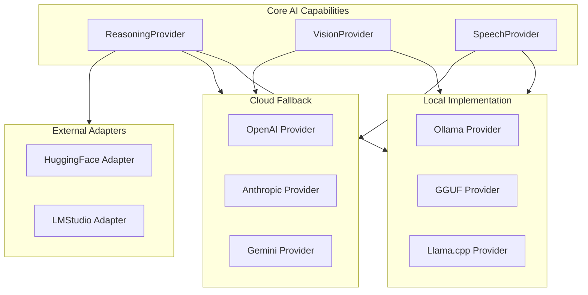
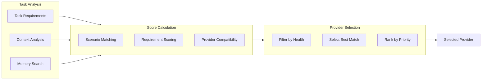
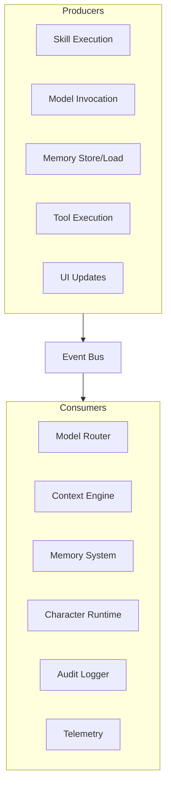

# 08_AI_GUIDELINES.md

> **Purpose:** Define the AI integration architecture, model selection, and orchestration patterns for CharOS.
>
> This document guides all AI-related decisions, ensuring the platform remains model-agnostic while providing a consistent interface for AI capabilities.

---

## 1. AI Architecture Philosophy

### 1.1 Model-Centric vs. Capability-Centric Design

> **CharOS is capability-driven, not model-driven.**
>
> The user never thinks about "Gemma 4" or "Qwen3 Coder". They ask Nila for help, and Nila uses the appropriate capability.

### 1.2 Key Principles

| Principle | Implementation | What It Avoids |
|-----------|---------------|----------------|
| **Model Agnosticism** | Abstracted providers, adapters replace implementations | Tight coupling to specific models |
| **Capability Abstraction** | Skills represent domain expertise, not model types | Prompt engineering as core logic |
| **Local-First, Cloud-Optional** | Local execution by default, cloud fallback only when needed | Vendor lock-in, privacy concerns |
| **Deterministic Routing** | Context-aware model selection, consistent behavior | Unpredictable AI responses |

---

## 2. Provider Architecture

### 2.1 Unified Provider Interface

```typescript
// Base interface for all AI providers
interface BaseProvider {
    readonly id: string;           // Unique identifier
    readonly metadata: ProviderMetadata;
    readonly capabilities: Capability[];
    initialize(config: ProviderConfig): Promise<void>;
    isHealthy(): Promise<boolean>;
    dispose(): Promise<void>;
}

// Model-specific providers extend this
interface ReasoningProvider extends BaseProvider {
    complete(request: CompletionRequest): Promise<CompletionResponse>;
    stream(request: CompletionRequest): AsyncIterable<CompletionChunk>;
}

interface VisionProvider extends BaseProvider {
    analyze(image: ImageInput, request: VisionRequest): Promise<VisionResult>;
}

interface SpeechProvider extends BaseProvider {
    transcribe(audio: AudioInput): Promise<TranscriptionResult>;
    synthesize(text: string, voice?: VoiceConfig): Promise<AudioOutput>;
}
```

### 2.2 Provider Taxonomy



### 2.3 Provider Registration

```json
{
  "id": "gemma-4-heretic-local",
  "type": "reasoning",
  "name": "Gemma 4 Heretic (Ollama)",
  "version": "1.0.0",
  "capabilities": ["general", "planning", "summarization"],
  "provider": {
    "type": "ollama",
    "baseUrl": "http://localhost:11434",
    "model": "gemma-4-heretic"
  },
  "priority": 1,
  "healthCheck": {"interval": 300000},
  "maxTokens": 8192,
  "maxContextLength": 32768
}
```

---

## 3. Model Routing Architecture

### 3.1 Router Responsibilities

> **The Router decides what model to use for what task, never *what* to do.**

#### Router Decision Factors

| Factor | Description | Example |
|--------|-------------|----------|
| **Task Complexity** | Simple vs. multi-step reasoning | "Hello" → Gemma 4<br>"Refactor auth module" → Qwen3 Coder |
| **Context Length** | Few-shot vs. long context | "Project summary" → Gemma 4<br>"Review 50K line file" → Qwen3 Coder |
| **Domain Expertise** | Code vs. general reasoning | "Summarize meeting" → Gemma 4<br>"Fix bug in cache" → Qwen3 Coder |
| **Resource Availability** | Local model health, GPU memory | If HuggingFace unavailable → Ollama |
| **User Preferences** | Career mode, creativity level | Adjust complexity based on settings |

### 3.2 Context-Based Routing

```typescript
interface ContextBundle {
    task: Task;
    userProfile: UserProfile;
    workingMemory: MemoryItem[];
    episodicMemory: MemoryItem[];
    semanticMemory: MemoryItem[];
    projectContext: ProjectContext;
}

interface Task {
    id: string;
    goal: string;
    type: TaskType;
    parameters: TaskParameters;
    estimatedComplexity: number; // 0-1
}

type TaskType = 
    | 'conversation'
    | 'coding'
    | 'reasoning'
    | 'vision'
    | 'research'
    | 'planning';

class ModelRouter implements ModelRouterInterface {
    selectReasoning(task: Task, context: ContextBundle): ModelSelection {
        const complexity = this.estimateComplexity(task, context);
        const contextLength = this.calculateContextLength(context);
        const domain = this.identifyDomain(task, context);
        
        return {
            provider: this.selectProvider('reasoning', {
                complexity,
                contextLength,
                domain
            }),
            model: this.selectModel('reasoning', complexity),
            parameters: this.generateParameters(task, context),
            fallback: { provider: 'ollama', model: 'gemma-4-heretic' }
        };
    }
}
```

### 3.3 Capability-Based Selection



---

## 4. Skill System Integration

### 4.1 Skill-to-Model Mapping

| Skill | Primary Model | Fallback Model | Reasoning |
|-------|---------------|----------------|-----------|
| Summarize | Gemma 4 | Qwen3 Coder | Simple text processing, budget-friendly |
| Code Refactor | Qwen3 Coder | Gemma 4 | Understanding code, structural changes |
| Research | Gemma 4 → Cloud | Gemini (fallback) | Deep research requiring broad knowledge |
| Visual Analysis | Qwen2-VL | Cloud Vision | GPU-accelerated, specialized for images |
| Voice Command | Handy-Parakeet | Cloud STT | Offline-first, privacy-sensitive |

### 4.2 Model-Aware Skills

```typescript
interface SkillDefinition {
    id: string;
    name: string;
    description: string;
    category: SkillCategory;
    inputs: SkillParameter[];
    outputs: SkillOutput[];
    modelRequirements: ModelRequirements;
    toolRequirements: ToolCategory[];
    timeout: number;
}

interface ModelRequirements {
    capability: AIProviderCapability;
    minComplexity: number;
    preferredProviders: string[];
    fallbackChain: string[];
    contextWindow: ContextWindow;
}

interface ContextWindow {
    maxTokens: number;
    preferredContextLength: 'short' | 'medium' | 'long';
}
```

### 4.3 Skill Execution Flow

```
mermaid
sequenceDiagram
    participant User
    participant UI
    participant Core
    participant Router
    participant Skill
    participant Model
    participant Tools

    User->>UI: Request
    UI->>Core: ExecuteSkill(skillId, params)
    Core->>Router: SelectModel(task, context)
    Router->>Skill: Validate(skillId)
    Skill->>Model: Invoke(modelSelection, prompt)
    Model->>Skill: Response
    Skill->>Tools: Execute(tools)
    Tools->>Skill: Results
    Skill->>Core: Result
    Core->>UI: Display
```

---

## 5. Memory Integration

### 5.1 Context Assembly for AI

```typescript
interface ContextAssembly {
    // Static context
    systemPrompt: SystemPrompt;
    conversationHistory: ConversationTurn[];
    
    // Dynamic context from memory layers
    workingMemory: MemoryItem[];
    episodicMemory: MemoryItem[];
    semanticMemory: MemoryItem[];
    consolidatedKnowledge: KnowledgeChunk[];
    
    // Project-specific context
    projectScope: ProjectScope;
    currentTask: Task;
    
    // Optimization
    tokenBudget: number;
    compressionStrategies: CompressionStrategy[];
}

class ContextEngine {
    buildContext(task: Task, memory: MemoryProvider): ContextBundle {
        // Reorder by importance
        const items = [
            this.workingMemorySlice(task),
            this.relevantEpisodic(task),
            this.semanticKnowledge(task),
            this.projectSpecific(task),
            this.recentConversation()
        ];
        
        // Compress if needed
        return this.compressContext(items, tokenBudget);
    }
}
```

### 5.2 AI-Aware Memory Strategies

#### Working Memory

**Goal:** Keep relevant conversation pieces for current task.

- **TTL:** 1 hour (configurable)
- **Window size:** 10 most recent interactions
- **Pruning:** Remove irrelevant, keep task-relevant

#### Episodic Memory

**Goal:** Store important events and decisions.

- **Triggers:** Model failures, user preferences, task outcomes
- **Format:** Structured events (timestamp, context, outcome)
- **Deduplication:** Remove near-identical events

#### Semantic Memory

**Goal:** Curated knowledge base for long-term intelligence.

- **Sources:** Expert summaries, documentation, conversations
- **Layering:** Simple facts → complex concepts
- **Linking:** Create relationships between concepts

---

## 6. Integration Patterns

### 6.1 Event-Driven AI Communication



| Event | Purpose | Consumers |
|-------|---------|-----------|
| `ModelRequested` | Router decision | Metrics, Audits |
| `ModelResponse` | Execution result | Context Engine, Skills |
| `ContextBuilt` | Ready for AI | Skills, Character |
| `SkillExecuted` | Tool usage audit | Memory, Metrics |
| `TaskCompleted` | Outcome logging | Memory, User Feedback |

### 6.2 Plugin System for Model Extensions

```json
{
  "id": "model-adapter-llama.cpp",
  "name": "llama.cpp Adapter",
  "version": "2.1.0",
  "capabilities": ["reasoning", "vision"],
  "entry": "dist/adapter.js",
  "provides": ["reasoning", "vision"],
  "config_schema": {
    "type": "object",
    "properties": {
      "model_path": {"type": "string"},
      "context_length": {"type": "integer"},
      "gpu_layers": {"type": "integer"}
    }
  },
  "installation": {
    "type": "binary",
    "url": "https://github.com/llama-cpp/llama.cpp",
    "setup": "make -j4"
  }
}
```

---

## 7. Optimization Strategies

### 7.1 Performance Optimization

#### Layered Optimization

1. **Model Selection Optimization**
   - Cache hot paths (complex tasks → preferred model)
   - Pre-warm models (load on startup, keep warm)
   - Batch inference (parallel requests when possible)

2. **Context Optimization**
   - Token-aware compression
   - Priority-based memory ordering
   - Dynamic windowing based on task

3. **Skill Optimization**
   - Warm up tool environments
   - Cache skill metadata
   - Pre-compile tool schemas

### 7.2 Resource Management

```typescript
interface ResourceManager {
    readonly modelSlots: number;        // GPU/CPU slots available
    readonly memoryBudget: number;      // RAM available
    readonly timeoutBudget: number;     // Total wait time
    
    canRun(task: Task): boolean;
    reserve(model: string, task: Task): Promise<void>;
    release(model: string): void;
    getAllocation(task: Task): ResourceAllocation;
}
```

### 7.3 Cost Management

**Implementation:**

1. **Local-first:** Always try local models first
2. **Token budgeting:** Limit token usage per request
3. **Fallback efficiency:** Prefer lighter models when downgrading
4. **Caching:** Reuse results for common queries

---

## 8. Error Handling & Recovery

### 8.1 AI-Specific Errors

| Error Type | Detection | Recovery Strategy |
|------------|-----------|-------------------|
| **ModelTimeout** | Request duration > 30s | Fallback to lighter model |
| **ModelOOM** | Memory error during inference | Use smaller context window |
| **ModelResponseInvalid** | JSON parsing failure | Retry with simpler prompt |
| **ModelUnavailable** | Health check failed | Use backup provider |
| **CapabilityMismatch** | Task requires unsupported feature | Degrade task scope |

### 8.2 Graceful Degradation

> **When the preferred AI fails, attempt to complete the task with alternatives.**

```typescript
class AICapabilityManager {
    async executeWithFallback(
        task: Task,
        fallbackChain: string[]
    ): Promise<TaskResult> {
        for (const providerId of fallbackChain) {
            try {
                const provider = this.getProvider(providerId);
                const result = await provider.execute(task);
                return result;
            } catch (error) {
                if (this.isRecoverable(error)) {
                    continue;
                }
                throw error;
            }
        }
    }
}
```

---

## 9. Monitoring & Observability

### 9.1 AI-Specific Metrics

| Metric | Type | Description |
|--------|------|-------------|
| `charos.ai.model.invocations` | Counter | Model usage by provider |
| `charos.ai.model.latency_ms` | Histogram | Inference time distribution |
| `charos.ai.model.token_usage` | Histogram | Tokens consumed per request |
| `charos.ai.model.failure_rate` | Gauge | Error rate per provider |
| `charos.ai.context.compression` | Histogram | Context compression ratio |
| `charos.ai.skill.execution_time` | Histogram | Skill execution duration |

### 9.2 Health Checks

```typescript
interface AIHealthCheck {
    name: string;
    check(): Promise<HealthStatus>;
    interval: number; // ms
    timeout: number; // ms
}

const aiHealthChecks = [
    {
        name: 'ollama-provider',
        check: () => ollamaProvider.isHealthy(),
        interval: 30000,
        timeout: 10000
    },
    {
        name: 'qwen-coder-health',
        check: () => qwenCoderProvider.isHealthy(),
        interval: 60000,
        timeout: 15000
    },
    {
        name: 'cloud-fallback',
        check: () => cloudProvider.isHealthy(),
        interval: 120000,
        timeout: 20000
    }
];
```

---

## 10. Cross-References

| Document | Field | Relationship |
|----------|-------|-------------|
| `docs/00_VISION.md` | Section 5 | AI capabilities alignment |
| `docs/01_ARCHITECTURE.md` | Section 2 | Model provider interfaces |
| `docs/02_DESIGN_PHILOSOPHY.md` | Section 7 | Tool-driven architecture |
| `docs/03_TERMINOLOGY.md` | AI section | Canonical AI terminology |
| `docs/05_TECH_STACK.md` | Model section | Technology implementations |
| `docs/06_UI_GUIDELINES.md` | Character section | Character-AI integration |
| `ai/AGENTS.md` | All sections | Agent implementation guide |
| `ai/PLANNER.md` | All sections | Planner-AI interaction |
| `ai/MODEL_ROUTING.md` | All sections | Router implementation |
| `ai/TOOL_ROUTING.md` | All sections | Tool selection details |
| `memory/MEMORY.md` | All sections | Memory system for AI |
| `character/CHARACTER_SPEC.md` | All sections | Character personality inputs |
| `plugins/PLUGIN_API.md` | All sections | Plugin architecture |

---

## 11. Open Design Questions

### 11.1 Model Convergence Strategy

| Option | Pros | Cons |
|--------|------|------|
| **Monolithic provider** | Simple, consistent interface | Hard to swap individual models |
| **Microservices per model** | Fine-grained replacement | Complex routing, overhead |
| **Plugin registry** | Open extensibility | Discovery complexity |
| **Hybrid approach** | Balance flexibility with simplicity | Migration complexity |

**Status:** Plugin registry with centralized routing.

### 11.2 Local Model Management

| Option | Pros | Cons |
|--------|------|------|
| **Ollama-based** | Simple, standard | Requires Ollama setup |
| **Direct llama.cpp** | More control, possibly faster | Higher complexity |
| **Multiple backends** | Most flexible | Configuration complexity |
| **Containerized** | Isolation, portability | Resource overhead |

**Status:** Ollama-based with llama.cpp fallback.

### 11.3 Context Window Management

| Option | Pros | Cons |
|--------|------|------|
| **Static allocation** | Simple, predictable | Wasted resources |
| **Dynamic per task** | Efficient, adaptive | Implementation complexity |
| **Sliding window** | Continuous processing | May lose context |
| **Hierarchical** | Multiple tiers | Complex logic |

**Status:** Dynamic per task with sliding buffer.

---

## 12. TODOs for Implementation

- [ ] Design `ProviderConfig` interface with validation
- [ ] Implement `ModelRouter` with capability-based selection
- [ ] Create `ContextEngine` with token-aware assembly
- [ ] Set up `CapabilityManager` with fallback chains
- [ ] Build `HealthChecker` with provider health monitoring
- [ ] Implement `ResourceManager` with allocation tracking
- [ ] Create `AICapabilityManager` for graceful degradation
- [ ] Write tests for provider selection algorithms
- [ ] Set up observability for AI operations
- [ ] Record ADR for model routing strategy
- [ ] Record ADR for context assembly approach
- [ ] Record ADR for provider health monitoring
- [ ] Document provider lifecycle management

---

> **The AI should be transparent enough to debug but abstract enough to be useful.**
>
> *Models come and go. Capabilities remain constant.*

---

## 13. Technical Appendix

### 13.1 AI Provider Capabilities

```typescript
enum AIProviderCapability {
    // Reasoning
    'general',
    'complex_reasoning',
    'creative_writing',
    'analytical',
    
    // Coding
    'code_generation',
    'code_analysis',
    'refactoring',
    'debugging',
    
    // Specialized
    'vision',
    'speech_recognition',
    'speech_synthesis',
    'research',
    'planning'
}
```

### 13.2 Skill Complexity Classification

```typescript
enum SkillComplexity {
    'simple',        // < 1000 tokens
    'moderate',      // 1000-5000 tokens
    'complex',       // 5000-20000 tokens
    'expert',        // > 20000 tokens
    'fast',          // Can run sub-second
    'streaming'      // Supports streaming responses
}
```

### 13.3 Model Performance Tiers

| Tier | Latency | Cost | Use Case |
|------|---------|------|----------|
| **Fast** | < 500ms | Low | Quick questions |
| **Balanced** | 500-2000ms | Medium | Task execution |
| **Deep** | 2000-5000ms | High | Complex reasoning |

> **CharOS is not about showcasing AI. It is about applying AI to human problems.**