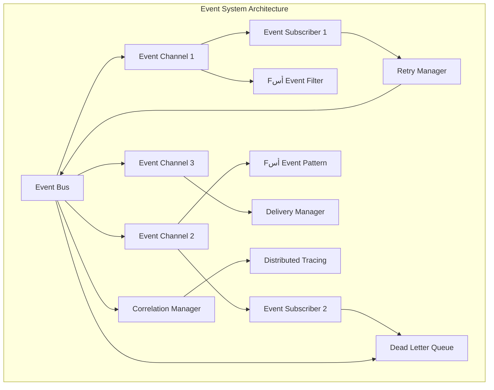

# EVENT_SYSTEM.md

> **Purpose:** Define the complete event system architecture, channels, and message flow for CharOS.
> This document specifies the event system's interface contracts, message formats, and channel architecture.

---

## 1. Event System Architecture

### 1.1 Event System Philosophy

> **Event systems are the nervous system of distributed architectures.**
>
> CharOS uses events as the primary communication mechanism between all subsystems, ensuring loose coupling and high cohesion across the platform.

### 1.2 System Overview

**Event-driven architecture:**

```
┌─────────────────────────────────────────────────────────────┐
│                    EVENT SYSTEM (Rust + TypeScript)       │
├─────────────────────────────────────────────────────────────┤
│  ┌─────────────────┐ ┌─────────────────┐ ┌──────────────┐ │
│  │  Event Bus     │ │  Event Channels │ │  Subscribers │ │
│  │  Core Layer    │ │  (Namespace)    │ │  (Consumers) │ │
│  └─────────────────┘ └─────────────────┘ └──────────────┘ │
├─────────────────────────────────────────────────────────────┤
│  ┌─────────────────┐ ┌─────────────────┐ ┌──────────────┐ │
│  │   Publishers    │ │   Message      │ │   Filters    │ │
│  │   (Producers)  │ │   Format        │ │   (By Type)  │ │
│  └─────────────────┘ └─────────────────┘ └──────────────┘ │
└─────────────────────────────────────────────────────────────┘
```

### 1.3 Event System Categories

| Category | Scope | Use Case | Examples |
|----------|-------|----------|----------|
| **Core Events** | Global | Platform state, errors | SystemStarted, TaskCompleted, ErrorOccurred |
| **Channel Events** | Namespaced | Grouped functionality | character.state, memory.updated, tool.execution |
| **Actor Events** | Per-component | Single-system messages | Character.SpeechBubble, Planner.TaskGraph |
| **System Events** | Cross-cutting | Logging, monitoring | HealthCheck, MetricsUpdate, SecurityAlert |

---

## 2. Event Bus Interface

### 2.1 Event Bus Contract

**Core event bus interface:**

```typescript
interface IEventBus {
  readonly id: string;
  readonly name: string;
  readonly version: string;
  readonly configuration: EventBusConfig;
  
  // Event publishing (typed)
  publish<EventType extends AppEvent>(event: EventType): void;
  publish<EventType extends AppEvent>(channel: string, eventType: string, payload: EventType['payload']): void;
  
  // Event subscription management
  subscribe<EventType extends AppEvent>(channel: string, handler: EventHandler<EventType>): Subscription;
  subscribeOnce<EventType extends AppEvent>(channel: string, handler: EventHandler<EventType>): Subscription;
  subscribeFilter<EventType extends AppEvent>(filter: EventFilter, handler: EventHandler<EventType>): Subscription;
  
  // Channel management
  createChannel(channelName: string, config?: ChannelConfig): IEventChannel;
  getChannel(channelName: string): IEventChannel | null;
  listChannels(): string[];
  removeChannel(channelName: string): boolean;
  
  // Subscription lifecycle
  unsubscribe(subscription: Subscription): void;
  unsubscribeAll(channel?: string): void;
  getSubscriptions(channel?: string): Subscription[];
  
  // Event lifecycle
  ackEvent(eventId: string): void;
  nackEvent(eventId: string, reason: string): void;
  getEventStatus(eventId: string): EventStatus;
  
  // Event querying
  getEvents(channel: string, since?: number, until?: number, limit?: number): AppEvent[];
  clearEvents(channel?: string): void;
  
  // Event patterns
  addPattern(pattern: EventPattern): void;
  removePattern(pattern: EventPattern): void;
  getPatterns(): EventPattern[];
  
  // Configuration
  reconfigure(config: Partial<EventBusConfig>): void;
}
```

### 2.2 Event Bus Configuration

```typescript
interface EventBusConfig {
  readonly id: string;
  readonly name: string;
  readonly version: string;
  
  // Core behavior
  readonly maxSubscribers: number;
  readonly maxBufferSize: number;
  readonly maxHistorySize: number;
  readonly maxPublishConcurrency: number;
  readonly eventTimeout: number; // milliseconds
  
  // Delivery guarantees
  readonly deliveryGuarantee: 'at_least_once' | 'at_most_once' | 'exactly_once';
  readonly retryPolicy: RetryPolicy;
  readonly deduplication: boolean;
  
  // Performance tuning
  readonly lazyInitialization: boolean;
  readonly backgroundProcessing: boolean;
  readonly workerThreads: number;
  readonly batchSize: number;
  readonly batchTimeout: number;
  
  // Memory management
  readonly eventRetention: EventRetentionPolicy;
  readonly memoryLimit: number; // MB
  readonly cleanupInterval: number; // milliseconds
  
  // Security
  readonly authentication: boolean;
  readonly authorization: boolean;
  readonly encryption: boolean;
  readonly auditLogging: boolean;
}
```

---

## 3. Event Message Structure

### 3.1 Base Event Interface

**Standard event message format:**

```typescript
interface AppEvent {
  readonly id: string;
  readonly version: string;
  readonly namespace: string;
  readonly channel: string;
  
  // Message metadata
  readonly timestamp: number;
  readonly source: EventSource;
  readonly correlationId: string;
  readonly parentEventId?: string;
  readonly traceId?: string;
  
  // Event identification
  readonly eventType: string;
  readonly eventName: string;
  readonly category: EventCategory;
  readonly priority: EventPriority;
  
  // Message content
  readonly payload: any;
  readonly metadata: EventMetadata;
  
  // Delivery tracking
  readonly attempts: number;
  readonly lastAttempt?: number;
  readonly deliveryStatus: DeliveryStatus;
  readonly deliveryTimestamp?: number;
  readonly error?: string;
  
  // Computed properties
  readonly age: number;
  readonly isExpired: boolean;
  readonly isDeadLetter: boolean;
}
```

### 3.2 Event Source

```typescript
interface EventSource {
  readonly component: string;
  readonly service: string;
  readonly instance: string;
  readonly processId: number;
  readonly nodeId?: string;
  readonly uptime: number;
}

interface EventMetadata {
  readonly persistent: boolean;
  readonly compressed: boolean;
  readonly encrypted: boolean;
  readonly archived: boolean;
  readonly tags: string[];
  readonly custom: Record<string, any>;
}
```

### 3.3 Event Types

```typescript
enum EventCategory {
  STATE = 'state',
  LIFE_CYCLE = 'lifecycle',
  ERROR = 'error',
  METRICS = 'metrics',
  SECURITY = 'security',
  CONFIG = 'config',
  PLUGIN = 'plugin',
  USER = 'user'
}

enum EventPriority {
  LOW = 0,
  NORMAL = 1,
  HIGH = 2,
  CRITICAL = 3
}

enum DeliveryStatus {
  PENDING = 'pending',
  DELIVERED = 'delivered',
  FAILED = 'failed',
  RETRYING = 'retrying',
  DROPPED = 'dropped'
}

enum EventRetentionPolicy {
  SHORT = 'short',      // < 1 hour
  MEDIUM = 'medium',    // 1 hour - 1 day
  LONG = 'long',        // 1 day - 1 week
  INFINITE = 'infinite' // permanent
}
```

---

## 4. Subscription System

### 4.1 Subscription Management

**Complete subscription interface:**

```typescript
interface Subscription {
  readonly id: string;
  readonly channel: string;
  readonly eventType: string;
  readonly handler: EventHandler<any>;
  readonly filter?: EventFilter;
  readonly options: SubscriptionOptions;
  readonly createdAt: number;
  readonly lastInvoked?: number;
  readonly invocationCount: number;
  readonly maxInvocations?: number;
  readonly errorCount: number;
  readonly status: SubscriptionStatus;
  
  // Lifecycle
  unsubscribe(): void;
  pause(): void;
  resume(): void;
  
  // Statistics
  getUptime(): number;
  getErrorRate(): number;
  getAverageLatency(): number;
}
```

### 4.2 Event Filtering

```typescript
interface EventFilter {
  readonly eventType?: string;
  readonly namespace?: string;
  readonly source?: Partial<EventSource>;
  readonly timeRange?: TimeRange;
  readonly metadata?: Partial<EventMetadata>;
  readonly customFilter?: (event: AppEvent) => boolean;
}

interface TimeRange {
  readonly start: number;
  readonly end: number;
  readonly inclusive: boolean;
}

interface SubscriptionOptions {
  readonly autoRenew: boolean;
  readonly qos: QualityOfService;
  readonly routingKey?: string;
  readonly exclusive: boolean;
  readonly durable: boolean;
}

enum QualityOfService {
  AT_MOST_ONCE,
  AT_LEAST_ONCE,
  EXACTLY_ONCE
}

enum SubscriptionStatus {
  ACTIVE,
  PAUSED,
  EXPIRED,
  REMOVED
}
```

---

## 5. Event Channels

### 5.1 Channel Architecture

**Channel-based event organization:**

```typescript
interface IEventChannel {
  readonly name: string;
  readonly bus: IEventBus;
  readonly configuration: ChannelConfig;
  readonly statistics: ChannelStatistics;
  
  // Event publishing
  publish<EventType extends AppEvent>(event: EventType): string;
  publish<EventType extends AppEvent>(eventType: string, payload: EventType['payload']): string;
  
  // Event subscription
  subscribe<EventType extends AppEvent>(handler: EventHandler<EventType>): Subscription;
  subscribeOnce<EventType extends AppEvent>(handler: EventHandler<EventType>): Subscription;
  subscribeFilter<EventType extends AppEvent>(filter: EventFilter, handler: EventHandler<EventType>): Subscription;
  
  // Channel management
  getChannel(name: string): IEventChannel;
  createChannel(name: string, config?: ChannelConfig): IEventChannel;
  removeChannel(): boolean;
  
  // Statistics
  getStatistics(): ChannelStatistics;
  resetStatistics(): void;
  
  // Configuration
  reconfigure(config: Partial<ChannelConfig>): void;
}
```

### 5.2 Channel Configuration

```typescript
interface ChannelConfig {
  readonly name: string;
  readonly description: string;
  readonly eventTypes: EventTypeDefinition[];
  
  // Delivery
  readonly durable: boolean;
  readonly exclusive: boolean;
  readonly autoCreate: boolean;
  readonly defaultTTL: number;
  
  // Performance
  readonly maxSubscribers: number;
  readonly maxBufferSize: number;
  readonly maxPublishConcurrency: number;
  readonly deliveryGuarantee: DeliveryGuarantee;
  
  // Security
  readonly authentication: boolean;
  readonly encryption: boolean;
  
  // Routing
  readonly routingKey?: string;
  readonly topicPattern?: string;
  readonly queue?: string;
  
  // Statistics
  readonly collectStatistics: boolean;
  readonly reportingInterval: number;
}
```

### 5.3 Event Patterns

**Message routing patterns:**

```typescript
interface EventPattern {
  readonly name: string;
  readonly description: string;
  readonly pattern: string;
  readonly options: PatternOptions;
}

enum PatternOptions {
  WILDCARD,          // * (matches any single word)
  MULTI_WILDCARD,    // > (matches zero or more words)
  SINGLE_CHARACTER,  // ? (matches any single character)
  LITERAL           // Exact match
}

enum DeliveryGuarantee {
  AT_MOST_ONCE,
  AT_LEAST_ONCE,
  EXACTLY_ONCE
}
```

---

## 6. Event Processing

### 6.1 Event Processing Pipeline

**Complete processing pipeline:**

```
┌─────────────────────────────────────────────────────────┐
│                    EVENT PIPELINE                     │
├─────────────────────────────────────────────────────────┤
│  ┌─────────────────┐ ┌─────────────────┐ ┌────────────┐ │
│  │    Ingestion    │ │   Filtering     │ │  Queuing   │ │
│  │   (Validate)   │ │    (Channel)    │ │ (Buffer)   │ │
│  └─────────────────┘ └─────────────────┘ └────────────┘ │
│                   │              │                │
│                   ▼              ▼                ▼
│  ┌─────────────────┐ ┌─────────────────┐ ┌────────────┐ │
│  │   Enrichment    │ │   Distribution  │ │  Delivery  │ │
│  │   (Metadata)   │ │    (Routing)    │ │ (Delivery) │ │
│  └─────────────────┘ └─────────────────┘ └────────────┘ │
│                   │              │                │
│                   ▼              ▼                ▼
│  ┌─────────────────┐ ┌─────────────────┐ ┌────────────┐ │
│  │   Processing    │ │   Acknowledgment │ │   Retry    │ │
│  │   (Handlers)   │ │     (ACK/NACK)  │ │   Logic    │ │
│  └─────────────────┘ └─────────────────┘ └────────────┘ │
│                   │              │                │
│                   ▼              ▼                ▼
│  ┌─────────────────┐ ┌─────────────────┐ ┌────────────┐ │
│  │   Error Handling│ │   Statistics    │ │  Cleanup   │ │
│  │    (Error  )   │ │    (Metrics)    │ │ (Retention)│ │
│  └─────────────────┘ └─────────────────┘ └────────────┘ │
└─────────────────────────────────────────────────────────┘
```

### 6.2 Message Delivery Guarantees

**Different delivery guarantees:**

```typescript
interface DeliveryManager {
  readonly id: string;
  readonly name: string;
  readonly version: string;
  
  // Exactly-once delivery
  publishExactlyOnce(event: AppEvent): Promise<string>;
  
  // At-least-once delivery
  publishAtLeastOnce(event: AppEvent): Promise<string>;
  
  // At-most-once delivery
  publishAtMostOnce(event: AppEvent): Promise<string>;
  
  // Retry logic
  retry(eventId: string, delay: number, maxRetries: number): Promise<void>;
  scheduleRetry(eventId: string, delay: number): void;
  cancelRetry(eventId: string): void;
  
  // Dead letter handling
  moveToDeadLetter(event: AppEvent, reason: string): void;
  getDeadLetterEvents(): AppEvent[];
  removeDeadLetterEvents(eventId?: string): void;
}
```

### 6.3 Event Correlation

**Event correlation and tracing:**

```typescript
interface CorrelationManager {
  readonly id: string;
  readonly name: string;
  readonly version: string;
  
  // Correlation identification
  correlate(eventId: string, parentEventId: string): void;
  getCorrelationChain(eventId: string): string[];
  closeCorrelation(eventId: string): void;
  
  // Trace generation
  generateTraceId(): string;
  getEventChain(eventId: string): AppEvent[];
  
  // Context propagation
  extractTraceContext(event: AppEvent): TraceContext;
  injectTraceContext(event: AppEvent, context: TraceContext): AppEvent;
}

interface TraceContext {
  readonly traceId: string;
  readonly spanId: string;
  readonly parentSpanId?: string;
  readonly samplingRate: number;
  readonly tags: TraceTag[];
}
```

---

## 7. Channel-Specific Event Types

### 7.1 Core Channel Types

**Standard event channels:**

| Channel | Description | Events | Consumers |
|---------|-------------|--------|-----------|
| `system` | System lifecycle and status | SystemStarted, SystemShutdown, Heartbeat | Core Orchestrator, Monitoring |
| `character` | Character state and behavior | CharacterStateChanged, AnimationTriggered, SpeechBubbled | Character Runtime, UI |
| `planner` | Planning lifecycle and tasks | TaskPlanned, TaskStarted, TaskCompleted, TaskFailed | Planner, Memory, UI |
| `memory` | Memory system operations | MemoryStored, MemoryRetrieved, ConsolidationCompleted | Memory, ContextEngine |
| `models` | Model provider operations | ModelRequested, ModelResponse, ModelError | ModelRouter, Metrics |
| `skills` | Skill execution and results | SkillInvoked, SkillExecuted, SkillFailed | SkillRegistry, Tools, Memory |
| `tools` | Tool execution and side effects | ToolInvoked, ToolExecuted, ToolFailed | ToolProvider, Permissions, Audit |
| `events` | Internal event system | EventPublished, EventSubscribed, EventUnsubscribed | EventBus, Monitoring |
| `config` | Configuration changes | ConfigUpdated, ConfigValidated, ConfigError | ConfigProvider, All subsystems |
| `security` | Security events | PermissionGranted, AuthSuccess, SecurityAlert | SecurityEngine, Audit |

### 7.2 Channel-Specific Events

**Channel-specific event definitions:**

```typescript
// Character channel events
interface CharacterEvents {
  readonly namespace: 'character';
  readonly events: {
    'state.changed': {
      type: 'character.state.changed';
      payload: {
        characterId: string;
        fromState: CharacterState;
        toState: CharacterState;
        timestamp: number;
      };
      source: EventSource;
    };
    'animation.triggered': {
      type: 'character.animation.triggered';
      payload: {
        animationName: string;
        parameters: AnimationParameters;
      };
    };
    'speech.bubbled': {
      type: 'character.speech.bubbled';
      payload: {
        message: string;
        emotion?: string;
        duration?: number;
      };
    };
  };
}

// Memory channel events
interface MemoryEvents {
  readonly namespace: 'memory';
  readonly events: {
    'memory.stored': {
      type: 'memory.stored';
      payload: {
        entryId: string;
        layer: MemoryLayer;
        key: string;
        timestamp: number;
      };
    };
    'memory.retrieved': {
      type: 'memory.retrieved';
      payload: {
        entries: MemoryEntry[];
        query: MemoryQuery;
        timestamp: number;
      };
    };
    'consolidation.completed': {
      type: 'memory.consolidation.completed';
      payload: {
        sessionId: string;
        entriesConsolidated: number;
        duration: number;
      };
    };
  };
}
```

---

## 8. Error Handling

### 8.1 Event Error Types

**Event system error types:**

```typescript
enum EventErrorType {
  VALIDATION_ERROR,        // Event format or validation error
  SUBSCRIPTION_ERROR,       // Handler or subscription error
  DELIVERY_ERROR,          // Event delivery failure
  CHANNEL_ERROR,           // Channel operation error
  CORRELATION_ERROR,       // Correlation or tracing error
  QUEUE_OVERFLOW,          // Event buffer overflow
  TIMEOUT_ERROR,           // Event processing timeout
  SECURITY_ERROR,          // Authentication or authorization error
  UNKNOWN_ERROR            // Unclassified error
}
```

### 8.2 Error Handling Strategies

**Error handling approaches:**

```typescript
interface ErrorHandler {
  readonly id: string;
  readonly name: string;
  readonly version: string;
  
  // Error classification
  classify(error: Error): EventErrorType;
  
  // Error recovery
  handleError(error: Error, event: AppEvent): ErrorHandlingResult;
  
  // Error logging
  logError(error: Error, context: ErrorContext): void;
  
  // Error metrics
  recordErrorMetric(errorType: EventErrorType, handler: string): void;
}

interface ErrorHandlingResult {
  readonly handled: boolean;
  readonly retry: boolean;
  readonly moveToDeadLetter: boolean;
  readonly fallbackAction?: () => Promise<void>;
}
```

---

## 9. Statistics & Monitoring

### 9.1 Channel Statistics

**Channel performance metrics:**

```typescript
interface ChannelStatistics {
  readonly channelName: string;
  readonly uptime: number;
  readonly totalEvents: number;
  readonly totalSubscribers: number;
  readonly activeSubscribers: number;
  readonly eventsPublished: number;
  readonly eventsDelivered: number;
  readonly eventsFailed: number;
  readonly eventsExpired: number;
  readonly averageLatency: number;
  readonly maxLatency: number;
  readonly throughput: number; // events per second
  readonly memoryUsage: number; // MB
  readonly errorRate: number;
  readonly deliveryGuarantee: DeliveryGuarantee;
}
```

### 9.2 Event Bus Statistics

**Event bus performance metrics:**

```typescript
interface EventBusStatistics {
  readonly totalChannels: number;
  readonly totalSubscribers: number;
  readonly activeChannels: number;
  readonly totalEventsProcessed: number;
  readonly totalErrors: number;
  readonly systemUptime: number;
  readonly memoryUsage: number;
  readonly cpuUsage: number;
  readonly eventsPerSecond: number;
  readonly channelDistribution: ChannelDistribution[];
}
```

---

## 10. Configuration

### 10.1 Event System Configuration

**Complete configuration specification:**

```typescript
interface EventSystemConfig {
  // Event Bus configuration
  readonly eventBus: EventBusConfig;
  
  // Channel configurations
  readonly channels: Record<string, ChannelConfig>;
  
  // Event filters
  readonly defaultFilters: EventFilter[];
  
  // Delivery guarantees
  readonly deliveryGuarantee: DeliveryGuarantee;
  
  // Error handling
  readonly errorHandler: ErrorHandlerConfig;
  
  // Monitoring
  readonly monitoring: MonitoringConfig;
  
  // Security
  readonly security: SecurityConfig;
}
```

### 10.2 Event Pattern Configuration

**Event pattern specifications:**

```typescript
interface EventPatternConfig {
  readonly name: string;
  readonly pattern: EventPattern;
  readonly channel: string;
  readonly eventType?: string;
  readonly handler?: EventHandler<any>;
  readonly filter?: EventFilter;
  readonly options?: PatternOptions;
}
```

---

## 11. Cross-References

| Document | Relationship |
|----------|--------------|
| `docs/01_ARCHITECTURE.md` | Core event system architecture |
| `docs/02_DESIGN_PHILOSOPHY.md` | Event-driven design principles |
| `docs/05_TECH_STACK.md` | Technology choices |
| `API_CONTRACTS.md` | Event Bus interface contracts |
| `PERMISSIONS.md` | Event permissions and access control |
| `SECURITY_MODEL.md` | Security requirements |

---

## 12. TODOs for Implementation

- [ ] Design `EventBus` implementation with typed channels
- [ ] Implement `EventChannel` with filtering and routing
- [ ] Create `SubscriptionManager` with lifecycle management
- [ ] Build `DeliveryManager` with retry logic
- [ ] Implement `CorrelationManager` for distributed tracing
- [ ] Design `ErrorHandler` with event-specific error handling
- [ ] Create `StatisticsCollector` for performance monitoring
- [ ] Set up `EventRetentionManager` for memory management
- [ ] Record ADR for event system architecture
- [ ] Record ADR for channel design decisions
- [ ] Record ADR for delivery guarantees
- [ ] Create event system testing framework

---

## 13. Performance Considerations

### 13.1 Event Processing Optimizations

**Performance optimization strategies:**

1. **Batch Processing:** Process events in batches for efficiency
2. **Async Operations:** Use async/await for non-blocking operations
3. **Memory Management:** Implement efficient garbage collection
4. **Filter Optimization:** Pre-compile event filters for fast matching
5. **Connection Pooling:** Reuse database connections

### 13.2 Scalability Design

**Scalability considerations:**

- **Horizontal scaling:** Event bus can be scaled horizontally
- **Partitioning:** Events can be partitioned by channel
- **Clustering:** Multiple event bus instances can be clustered
- **Load balancing:** Load can be distributed across workers

---

> **The event system is the nervous system of distributed architectures. Get it right, and everything else becomes trivial.**

> *CharOS events must be immutable, ordered, and traceable for reliable operation.*

---

## 14. Technical Appendix

### 14.1 Event Delivery Guarantees

**Detailed delivery guarantee implementations:**

```typescript
interface ExactlyOnceDelivery extends DeliveryGuarantee {
  readonly type: 'exactly_once';
  
  // Implementation details
  useIdempotentOperations(): boolean;
  storeEventIdempotencyKey(event: AppEvent): Promise<string>;
  verifyIdempotency(eventId: string, key: string): Promise<boolean>;
}

interface AtLeastOnceDelivery extends DeliveryGuarantee {
  readonly type: 'at_least_once';
  
  // Implementation details
  useRetryLogic(): boolean;
  maxRetryAttempts: number;
  retryDelay: number;
}

interface AtMostOnceDelivery extends DeliveryGuarantee {
  readonly type: 'at_most_once';
  
  // Implementation details
  dropIfProcessing: boolean;
  crashRecovery: boolean;
}
```

### 14.2 Event Serialization

**Event serialization formats:**

```typescript
interface EventSerializer {
  readonly id: string;
  readonly name: string;
  readonly version: string;
  
  // Serialization
  serialize(event: AppEvent): SerializedEvent;
  deserialize(data: SerializedEvent): AppEvent;
  
  // Compression
  compress(event: AppEvent): CompressedEvent;
  decompress(compressed: CompressedEvent): AppEvent;
  
  // Encryption
  encrypt(event: AppEvent, key: EncryptionKey): EncryptedEvent;
  decrypt(event: EncryptedEvent, key: EncryptionKey): AppEvent;
}
```

### 14.3 Event Patterns

**Common event patterns:**

```typescript
enum EventPattern {
  // Publish-Subscribe
  PUBLISH_SUBSCRIBE,
  
  // Request-Response
  REQUEST_RESPONSE,
  
  // Event Sourcing
  EVENT_SOURCING,
  
  // Command Pattern
  COMMAND_PATTERN,
  
  // Observer Pattern
  OBSERVER_PATTERN,
  
  // Pub/Sub with Topics
  TOPIC_BASED_PUBLISH_SUBSCRIBE,
  
  // Fan-Out/Fan-In
  FAN_OUT_FAN_IN,
  
  // Pipeline Pattern
  PIPELINE_PROCESSING,
  
  // Circuit Breaker
  CIRCUIT_BREAKER,
  
  // Retry Pattern
  RETRY_PATTERN,
  
  // Bulkhead Pattern
  BULKHEAD_PATTERN
}
```

### 14.4 Event Architecture Diagram

**Complete event system architecture:**

