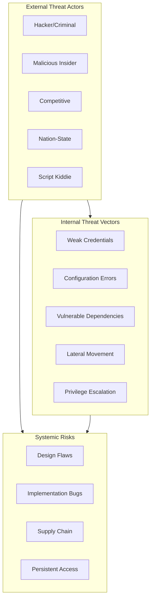

# SECURITY_MODEL.md

> **Purpose:** Define the security architecture, threat model, and security controls for CharOS.
> This document establishes the security foundation that all subsystems must adhere to.

---

## 1. Security Architecture Philosophy

### 1.1 Security by Design Principles

> **Security must be built into every component from day one, not added as an afterthought.**
>
> CharOS security follows the principle of "essential security" — only enforce what's necessary for safety, not convenience.

### 1.2 Security Layers

**Multi-layered security model:**

```
┌─────────────────────────────────────────────────────────┐
│                    APPLICATION LAYER                   │
│  ┌─────────────────┐ ┌─────────────────┐ ┌───────────┐ │
│  │ Security API    │ │ Permission     │ │ Auditing   │ │
│  │ Contract        │ │ System         │ │ & Logging  │ │
│  └─────────────────┘ └─────────────────┘ └───────────┘ │
├─────────────────────────────────────────────────────────┤
│                   INFRASTRUCTURE LAYER                   │
│  ┌─────────────────┐ ┌─────────────────┐ ┌───────────┐ │
│  │ Process         │ │ File System     │ │ Network    │ │
│  │ Isolation       │ │ Sandboxing      │ │ Controls   │ │
│  └─────────────────┘ └─────────────────┘ └───────────┘ │
├─────────────────────────────────────────────────────────┤
│                    PLATFORM LAYER                        │
│  ┌─────────────────┐ ┌─────────────────┐ ┌───────────┐ │
│  │ Key Management  │ │ Identity        │ │ Access     │ │
│  │                │ │ Management      │ │ Controls    │ │
│  └─────────────────┘ └─────────────────┘ └───────────┘ │
├─────────────────────────────────────────────────────────┤
│                   SYSTEM LAYER                           │
│  ┌─────────────────┐ ┌─────────────────┐ ┌───────────┐ │
│  │ System Calls    │ │ Native APIs     │ │ OS Security│ │
│  │ Hardening       │ │ Controls        │ │ Features   │ │
│  └─────────────────┘ └─────────────────┘ └───────────┘ │
└─────────────────────────────────────────────────────────┘
```

---

## 2. Threat Model

### 2.1 Security Objectives

**Core security goals:**

| Objective | Description | Implementation |
|-----------|-------------|----------------|
| **Confidentiality** | Protect user data and privacy | Encryption, access controls |
| **Integrity** | Ensure data consistency and trustworthiness | Hash verification, integrity checks |
| **Availability** | Maintain system uptime and accessibility | Redundancy, health checks |
| **Authentication** | Verify user and component identities | MFA, certificates, tokens |
| **Authorization** | Enforce access control policies | Permission system, RBAC |
| **Non-repudiation** | Prevent denial of actions | Digital signatures, audit logs |
| **Accountability** | Track who did what and when | Comprehensive logging |

### 2.2 Threat Categories

**Primary threat vectors:**



### 2.3 Attack Scenarios

**High-risk attack scenarios:**

1. **Remote Code Execution (RCE)**
   - Via plugin vulnerabilities
   - Through tool execution sandboxes
   - In memory consolidation processes

2. **Data Exfiltration**
   - Local memory extraction
   - Configuration data theft
   - User interaction hijacking

3. **Privilege Escalation**
   - Breaking plugin boundaries
   - Bypassing permission checks
   - Exploiting kernel vulnerabilities

4. **Denial of Service (DoS)**
   - Resource exhaustion (memory, CPU)
   - Network flood attacks
   - File system filling

5. **Supply Chain Compromise**
   - Malicious model providers
   - Compromised plugin repositories
   - Adversarial model poisoning

---

## 3. Security Architecture Components

### 3.1 Identity Management

**Core identity system:**

```typescript
interface IdentitySystem {
  readonly id: string;
  readonly name: string;
  readonly version: string;
  
  // User authentication
  authenticate(credentials: Credential): Promise<AuthResult>;
  authorize(request: AuthorizationRequest): Promise<AuthorizationResult>;
  
  // Component authentication
  register(component: ComponentIdentity): Promise<void>;
  verify(component: ComponentIdentity): Promise<boolean>;
  
  // Session management
  createSession(user: User): Session;
  validateSession(token: string): User;
  invalidateSession(token: string): void;
  
  // Security assertions
  assertPermission(user: User, resource: Resource, action: Action): boolean;
}

interface User {
  readonly id: string;
  readonly username: string;
  readonly roles: UserRole[];
  readonly permissions: Permission[];
  readonly mfaEnabled: boolean;
  readonly lastLogin: number;
  readonly expired: boolean;
}

interface ComponentIdentity {
  readonly componentId: string;
  readonly componentType: 'plugin' | 'service' | 'model' | 'memory';
  readonly version: string;
  readonly signerCertificate: Certificate;
  readonly capabilities: ComponentCapability[];
}
```

### 3.2 Permission System Integration

**Essential permission integration:**

```typescript
interface PermissionEngine {
  readonly id: string;
  readonly name: string;
  readonly version: string;
  
  // Permission evaluation
  checkPermission(user: User, resource: Resource, action: Action): PermissionResult;
  
  // Policy management
  createPolicy(policy: PermissionPolicy): Promise<void>;
  updatePolicy(policyId: string, update: Partial<PermissionPolicy>): Promise<void>;
  deletePolicy(policyId: string): Promise<void>;
  
  // Role-based access control
  assignRole(user: User, role: UserRole): void;
  removeRole(user: User, role: UserRole): void;
  
  // Temporal permissions
  grantTemporary(user: User, permission: Permission, duration: Duration): void;
}

interface Resource {
  readonly type: ResourceType;
  readonly identifier: string;
  readonly properties: ResourceProperties;
  readonly owner: string;
}

interface Action {
  readonly type: ActionType;
  readonly parameters: ActionParameters;
  readonly context: ActionContext;
}

interface PermissionResult {
  readonly granted: boolean;
  readonly reason?: string;
  readonly enforcement: PermissionEnforcement;
  readonly details?: PermissionDetails;
}
```

### 3.3 Security Controls Framework

**Core security control categories:**

1. **Technical Controls**
   - Encryption (at rest, in transit, end-to-end)
   - Access control (RBAC, ABAC, DAC)
   - Authentication (MFA, certificates, tokens)
   - Auditing (comprehensive logging)
   - Sanitization (input validation, output encoding)
   - Sandboxing (process isolation, syscalls)

2. **Administrative Controls**
   - Security policies and procedures
   - Security training and awareness
   - Incident response procedures
   - Change management processes

3. **Physical Controls**
   - Access control to facilities
   - Environmental controls
   - Backup and recovery procedures

---

## 4. Authentication System

### 4.1 Authentication Protocols

**Multi-protocol authentication:**

| Protocol | Use Case | Strengths | Weaknesses |
|----------|----------|-----------|------------|
| **Password-based** | Local users | Familiar, simple | Susceptible to phishing |
| **Biometric** | Device-local authentication | Convenient, strong | False positives/negatives |
| **Certificate-based** | System components | Mutual authentication | Complex management |
| **Hardware tokens** | High-security operations | FIDO2, OTP | Physical loss |
| **OAuth/OpenID** | Cloud services integration | Standards-based | Network dependency |

### 4.2 Password Security

**Password management requirements:**

```typescript
interface PasswordPolicy {
  readonly minLength: number;
  readonly requireUppercase: boolean;
  readonly requireLowercase: boolean;
  readonly requireNumbers: boolean;
  readonly requireSpecialChars: boolean;
  readonly maxAgeDays: number;
  readonly maxReuse: number;
  readonly blockCommonPasswords: boolean;
}

class PasswordManager {
  hash(password: string): Promise<PasswordHash>;
  verify(hash: PasswordHash, password: string): Promise<boolean>;
  validate(password: string, policy: PasswordPolicy): ValidationResult;
}
```

### 4.3 Multi-Factor Authentication

**MFA implementation:**

```typescript
interface MFASystem {
  readonly id: string;
  readonly name: string;
  readonly version: string;
  
  // OTP generation/validation
  generateOTP(user: User): string;
  validateOTP(user: User, code: string): Promise<boolean>;
  
  // Biometric authentication
  enrollBiometric(user: User, template: BiometricTemplate): void;
  authenticateBiometric(user: User, sample: BiometricSample): Promise<boolean>;
  
  // Push notifications
  sendPushNotification(user: User, request: MFARequest): Promise<void>;
  verifyPushResponse(user: User, response: PushResponse): Promise<boolean>;
}
```

---

## 5. Encryption & Data Protection

### 5.1 Encryption Requirements

**Comprehensive encryption strategy:**

```typescript
interface EncryptionManager {
  // Symmetric encryption (files, stored data)
  encryptSymmetric(data: Buffer, keyId: string): Promise<EncryptedData>;
  decryptSymmetric(encrypted: EncryptedData, keyId: string): Promise<Buffer>;
  
  // Asymmetric encryption (key exchange, signatures)
  encryptAsymmetric(data: Buffer, certificate: Certificate): Promise<EncryptedData>;
  decryptAsymmetric(encrypted: EncryptedData, privateKey: PrivateKey): Promise<Buffer>;
  
  // Key management
  generateKeypair(): Promise<KeyPair>;
  rotateKey(keyId: string): Promise<void>;
  revokeKey(keyId: string): Promise<void>;
}

interface DataProtection {
  // File encryption
  encryptFile(filePath: string): Promise<EncryptedFile>;
  decryptFile(encrypted: EncryptedFile): Promise<Buffer>;
  
  // Memory encryption
  encryptMemory(data: any): EncryptedMemory;
  decryptMemory(encrypted: EncryptedMemory): any;
  
  // In-transit encryption
  createSecureChannel(peerCertificate: Certificate): SecureChannel;
}
```

### 5.2 Cryptographic Standards

**Required standards:**

```typescript
// Encryption algorithms
const ENCRYPTION_ALGORITHMS = {
  AES_GCM: { keySize: 256, nonceSize: 96 },
  ChaCha20_Poly1305: { keySize: 256, nonceSize: 96 },
  AES_CFB: { keySize: 256, ivSize: 128 }
} as const;

// Hash algorithms for integrity
const HASH_ALGORITHMS = {
  SHA256: { outputSize: 256 },
  SHA512: { outputSize: 512 },
  BLAKE3: { outputSize: 32 }
} as const;

// Signature algorithms
const SIGNATURE_ALGORITHMS = {
  RSA_PSS_SHA256: { keySize: 2048, maxData: 190 },
  ECDSA_SHA256: { curve: 'P-256', maxData: 48 }
} as const;
```

---

## 6. Access Control System

### 6.1 Role-Based Access Control (RBAC)

**RBAC implementation:**

```typescript
interface RoleBasedAccessControl {
  readonly id: string;
  readonly name: string;
  readonly version: string;
  
  // Role management
  createRole(role: RoleDefinition): Promise<Role>;
  updateRole(roleId: string, updates: Partial<RoleDefinition>): Promise<void>;
  deleteRole(roleId: string): Promise<void>;
  
  // Permission assignment
  assignPermission(roleId: string, permission: Permission): Promise<void>;
  removePermission(roleId: string, permissionId: string): Promise<void>;
  
  // User role management
  assignRoleToUser(userId: string, roleId: string): void;
  removeRoleFromUser(userId: string, roleId: string): void;
}

interface RoleDefinition {
  readonly id: string;
  readonly name: string;
  readonly description: string;
  readonly permissions: Permission[];
  readonly inheritance: string[]; // Parent roles
}
```

### 6.2 Attribute-Based Access Control (ABAC)

**ABAC for flexible policies:**

```typescript
interface AttributeBasedAccessControl {
  readonly id: string;
  readonly name: string;
  readonly version: string;
  
  // Policy evaluation
  evaluatePolicy(subject: Subject, action: Action, resource: Resource): PolicyDecision;
  
  // Policy management
  createPolicy(policy: ABACPolicy): Promise<void>;
  updatePolicy(policyId: string, updates: Partial<ABACPolicy>): Promise<void>;
  deletePolicy(policyId: string): Promise<void>;
}

interface ABACPolicy {
  readonly id: string;
  readonly name: string;
  readonly description: string;
  readonly rules: PolicyRule[];
  readonly combiningAlgorithm: CombiningAlgorithm;
}

interface PolicyRule {
  readonly id: string;
  readonly effect: 'permit' | 'deny';
  readonly conditions: Condition[];
  readonly decision: 'allow' | 'deny';
}
```

---

## 7. Auditing & Logging

### 7.1 Comprehensive Logging

**Structured security logging:**

```typescript
interface SecurityLogger {
  readonly id: string;
  readonly name: string;
  readonly version: string;
  
  // Event logging
  logSecurityEvent(event: SecurityEvent): Promise<void>;
  logAccessAttempt(event: AccessAttempt): Promise<void>;
  logAuthenticationEvent(event: AuthenticationEvent): Promise<void>;
  
  // Policy violations
  logPolicyViolation(event: PolicyViolation): Promise<void>;
  logAuthorizationFailure(event: AuthFailure): Promise<void>;
  
  // Performance tracking
  logSecurityPerformance(metrics: SecurityMetrics): Promise<void>;
}

interface SecurityEvent {
  readonly timestamp: number;
  readonly eventType: SecurityEventType;
  readonly severity: LogSeverity;
  readonly source: string;
  readonly user?: string;
  readonly sessionId?: string;
  readonly resource?: Resource;
  readonly action?: Action;
  readonly success: boolean;
  readonly details: EventDetails;
  readonly correlationId: string;
}
```

### 7.2 Audit Trail Requirements

**Non-repudiation and accountability:**

- **Log format:** Structured JSON with integrity checksums
- **Retention:** Minimum 90 days for security events, 1 year for access control
- **Alerts:** Immediate notification of critical security events
- **Tamper protection:** WORM storage with cryptographic verification
- **Access control:** Separate administrative access to audit logs

---

## 8. Sandboxing & Isolation

### 8.1 Process Isolation

**Multi-level process isolation:**

```typescript
interface IsolationManager {
  readonly id: string;
  readonly name: string;
  readonly version: string;
  
  // Sidecar processes
  createSidecar(type: SidecarType, config: ProcessConfig): Promise<ProcessHandle>;
  destroySidecar(processId: string): Promise<void>;
  
  // Syscall restrictions
  limitSyscalls(processId: string, allowed: Syscall[]): Promise<void>;
  restrictFileSystem(processId: string, path: string, permissions: FilePermissions): Promise<void>;
  
  // Resource controls
  setResourceLimits(processId: string, limits: ResourceLimits): Promise<void>;
}

interface ProcessConfig {
  readonly type: 'STT' | 'ModelRunner' | 'SkillWorker' | 'Browser' | 'Memory';
  readonly binaryPath: string;
  readonly arguments: string[];
  readonly environment: Record<string, string>;
  readonly workingDirectory: string;
  readonly capabilities: ProcessCapability[];
}
```

### 8.2 File System Security

**Protected filesystem operations:**

```typescript
interface FileSecurityManager {
  readonly id: string;
  readonly name: string;
  readonly version: string;
  
  // Path validation
  validatePath(path: string): ValidationResult;
  checkPathPermissions(path: string): FilePermissions;
  
  // Operation security
  secureRead(path: string): Promise<Buffer>;
  secureWrite(path: string, data: Buffer): Promise<void>;
  secureDelete(path: string): Promise<void>;
  
  // Backup and recovery
  createBackup(path: string): BackupHandle;
  restoreBackup(backup: BackupHandle, path: string): Promise<void>;
}
```

---

## 9. Key Management

### 9.1 Key Hierarchy

**Multi-tier key management:**

```
┌─────────────────────────────────────────────────────────┐
│                    USER KEYS                            │
│  ┌─────────────────┐ ┌─────────────────┐ ┌───────────┐ │
│  │ Password Hashes │ │ Session Tokens  │ │ MFA Secrets│ │
│  └─────────────────┘ └─────────────────┘ └───────────┘ │
├─────────────────────────────────────────────────────────┤
│                SYSTEM KEYS                              │
│  ┌─────────────────┐ ┌─────────────────┐ ┌───────────┐ │
│  │ API Keys        │ │ Certificate Keys│ │Internal Keys│ │
│  └─────────────────┘ └─────────────────┘ └───────────┘ │
├─────────────────────────────────────────────────────────┤
│                DATATYPE KEYS                             │
│  ┌─────────────────┐ ┌─────────────────┐ ┌───────────┐ │
│  │ File Encryption │ │ Memory Encryption│ │ Audit Keys │ │
│  └─────────────────┘ └─────────────────┘ └───────────┘ │
└─────────────────────────────────────────────────────────┘
```

### 9.2 Key Lifecycle Management

**Complete key lifecycle:**

```typescript
interface KeyLifecycleManager {
  readonly id: string;
  readonly name: string;
  readonly version: string;
  
  // Key generation
  generateKeyPair(keyType: KeyType, algorithm: Algorithm): Promise<KeyPair>;
  
  // Key distribution
  distributeKey(recipient: string, key: Key, algorithm: KeyDistribution): Promise<void>;
  
  // Key rotation
  scheduleKeyRotation(keyId: string, interval: Duration): void;
  rotateKey(keyId: string): Promise<KeyPair>;
  
  // Key revocation
  revokeKey(keyId: string, reason: RevocationReason): Promise<void>;
  recoverKey(keyId: string, recoveryMethod: RecoveryMethod): Promise<KeyPair>;
  
  // Key backup
  backupKey(keyId: string, backupLocation: string): BackupHandle;
  restoreKey(backup: BackupHandle): Promise<KeyPair>;
}
```

---

## 10. Compliance & Controls

### 10.1 Security Controls Matrix

**Applicable security controls:**

| Control Family | Requirement | Implementation |
|----------------|-------------|----------------|
| **Access Control** | Principle of least privilege | RBAC, ABAC, DAC |
| **Identification** | Unique user/component IDs | Digital certificates |
| **Authentication** | Strong authentication mechanisms | MFA, certificates |
| **Authorization** | Access decision making | Policy evaluation |
| **Data Protection** | Encryption of sensitive data | AES-256, ChaCha20 |
| **Audit** | Comprehensive activity logging | WORM storage |
| **System Integrity** | File and configuration integrity | Hash verification |
| **Physical Security** | Access control to infrastructure | Biometrics, cards |
| **Documentation** | Security policies and procedures | Living documentation |

### 10.2 Regulatory Compliance

**Common regulatory requirements:**

- **GDPR** (EU privacy): Data protection impact assessments
- **SOC 2** (Trust services): Security controls audit trail
- **ISO 27001** (Information security): Comprehensive ISMS
- **NIST** (Cybersecurity framework): Risk management framework
- **PCI DSS** (Payment cards): Card data protection

---

## 11. Cross-References

| Document | Relationship |
|----------|--------------|
| `docs/01_ARCHITECTURE.md` | Security integration in main architecture |
| `docs/02_DESIGN_PHILOSOPHY.md` | Security philosophy alignment |
| `docs/03_TERMINOLOGY.md` | Security terminology |
| `docs/04_PROJECT_STRUCTURE.md` | Security directory structure |
| `docs/05_TECH_STACK.md` | Security technology stack |
| `docs/06_UI_GUIDELINES.md` | Security in UI layer |
| `docs/07_CHARACTER_GUIDELINES.md` | Character runtime security |
| `docs/08_AI_GUIDELINES.md` | AI security integration |
| `api-contracts.md` | Interface contracts that enforce security |
| `SECURITY.md` | High-level security document that this spec details |

---

## 12. TODOs for Security Implementation

- [ ] Design `IdentitySystem` with multi-factor authentication
- [ ] Implement `PermissionEngine` with RBAC and ABAC policies
- [ ] Create `AuthorizationManager` for resource access control
- [ ] Build `SecurityLogger` with structured logging
- [ ] Implement `EncryptionManager` for data at rest and in transit
- [ ] Create `KeyLifecycleManager` for cryptographic key management
- [ ] Design `IsolationManager` for process and file system security
- [ ] Build `FileSecurityManager` for secure file operations
- [ ] Implement `ComplianceManager` for regulatory requirements
- [ ] Record ADR for threat model and security requirements
- [ ] Record ADR for security architecture decisions
- [ ] Create security testing framework
- [ ] Set up security monitoring and alerting

---

## 13. Security Performance Considerations

### 13.1 Security Overhead Budget

**Performance impact allocation:**

```typescript
interface SecurityOverhead {
  authenticationLatency: number;      // ms
  authorizationLatency: number;       // ms
  encryptionLatency: number;          // ms
  auditProcessingLatency: number;     // ms
  memoryOverhead: number;            // MB
  cpuOverhead: number;                // %
}

const SECURITY_OVERHEAD = {
  // Security API calls
  permissionCheck: 1,      // ms
  tokenValidation: 0.5,    // ms
  
  // Encryption/decryption
  symmetricEncryption: 10,  // ms for 1MB
  asymmetricDecryption: 20, // ms
  
  // Logging and auditing
  securityEventLog: 0.5,    // ms
  auditLogWrite: 1,        // ms
  
  // Memory usage
  sessionStorage: 10,      // MB
  auditTrail: 50,          // MB per day (90-day retention)
  keyStore: 5              // MB
} as const;
```

### 13.2 Tuning Guidelines

**Performance tuning recommendations:**

1. **Caching:** Cache permission checks for frequently accessed resources
2. **Batch processing:** Process security events in batches
3. **Asynchronous operations:** Move non-critical security operations to background
4. **Resource efficiency:** Use lightweight encryption algorithms where possible
5. **Scalability:** Design security components to scale with user base

---

> **Security is not a product to be built; it is a property to be cultivated in every decision.**

> *CharOS security is implemented through enforced contracts, not through security teams. The code itself must be secure.*

---

## 14. Technical Appendix

### 14.1 Security Event Taxonomy

**Event classification:**

```typescript
enum SecurityEventType {
  // Authentication events
  AUTH_SUCCESS, AUTH_FAILURE, PASSWORD_CHANGED, MFA_ENROLLED,
  
  // Authorization events
  ACCESS_ALLOWED, ACCESS_DENIED, PRIVILEGE_ESCALATION,
  
  // Data events
  DATA_ENCRYPTED, DATA_DECRYPTED, DATA_EXPORTED, DATA_IMPORTED,
  
  // System events
  PROCESS_LAUNCHED, PROCESS_TERMINATED, SYS_CALL_BLOCKED,
  
  // Configuration events
  CONFIG_MODIFIED, SECURITY_POLICY_UPDATED, AUDIT_CONFIG_CHANGED,
  
  // Plugin events
  PLUGIN_LOADED, PLUGIN_UNLOADED, PLUGIN_SECURITY_VIOLATION,
  
  // Network events
  CONNECTION_ESTABLISHED, CONNECTION_CLOSED, NETWORK_BLOCKED
}
```

### 14.2 Compliance Checkpoints

**Implementation verification:**

```typescript
interface ComplianceChecker {
  checkGDPRCompliance(): ComplianceResult;
  checkSOCDCompliance(): ComplianceResult;
  checkISO27001Compliance(): ComplianceResult;
  checkNISTCompliance(): ComplianceResult;
  
  // Automated checks
  verifyEncryption(): boolean;
  verifyAccessControls(): boolean;
  verifyAuditTrail(): boolean;
  verifyKeyManagement(): boolean;
  verifyIsolationControls(): boolean;
  
  // Evidence collection
  collectComplianceEvidence(): ComplianceEvidence[];
}
```